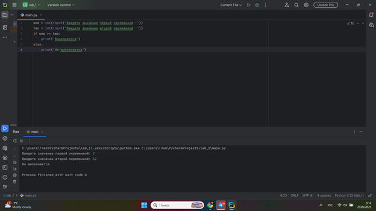

# Тема 3. Операторы, условия, циклы
Отчет по Теме #3 выполнил(а):
- Папета Глеб Павлович
- АИС-23-1

| Задание | Лаб_раб | Сам_раб |
| ------ | ------ | ------ |
| Задание 1 | + | + |
| Задание 2 | + | + |
| Задание 3 | + | + |
| Задание 4 | + | + |
| Задание 5 | + | + |
| Задание 6 | + | 
| Задание 7 | + | 
| Задание 8 | + | 
| Задание 9 | + | 
| Задание 10 | + | 

знак "+" - задание выполнено; знак "-" - задание не выполнено;


## Лабораторная работа №1
### Создайте две переменные, значение которых будете вводить через консоль. Также составьте условие, в котором созданные ранее переменные будут сравниваться, если условие выполняется, то выведете в консоль «Выполняется», если нет, то «Не выполняется».

```python
one = int(input('Введите значение первой переменной: '))
two = int(input('Введите значение второй переменной: '))
if one >= two:
    print('Выполняется')
else:
    print('Не выполняется')

```
### Результат.


## Выводы

1. Ввод данных - запрашивает у пользователя два целых числа и сохраняет их в переменные one и two
2.	Сравнение - проверяет условие one >= two (первое число больше или равно второму)
3.	Вывод результата:
o	Если условие истинно - выводит "Выполняется"
o	Если условие ложно - выводит "Не выполняется"


## Лабораторная работа №2
### Напишите программу, которая будет определять значения переменной меньше 0, больше 0 и меньше 10 или больше 10. Это нужно реализовать при помощи одной переменной, значение которой будет вводится через консоль, а также при помощи конструкций if, elif, else.
```python
one = int(input('Введите значение переменной: '))
if one < 0:
    print('Переменная меньше 0')
elif 0 < one < 10:
    print('Переменная больше 0 и меньше 10')
else:
    print('Переменная больше 10')

```
### Результат.

## Выводы

•	Ввод данных - пользователь вводит целое число, которое сохраняется в переменную one

if one < 0 - проверяет, является ли число отрицательным
•	elif 0 < one < 10 - проверяет, находится ли число в диапазоне от 0 до 10 (исключая границы)
•	else - все остальные случаи (число ≥ 10)


## Лабораторная работа №3
### Выведите в консоль три строки. Первая – обычная строка. Вторая – F строка с использованием заранее объявленной переменной. Третья – сложите две или более строк в одну.
```python
print('Привет, Мир!')

world = 'Мир'
print(f"Привет, {world}!")

one = 'Привет,'
two = 'Мир!'
print(one+two)
```
### Результат.

## Выводы

1. Обычная строка - вывод фиксированного текста

2. F-строка - использование переменной внутри строки через форматирование

## Лабораторная работа №4
### Выведите в консоль три строки. Первая – трансформация любого типа переменной в bool. Вторая – трансформация любого типа переменной в float или int. Третья – трансформация любого типа переменной в str
```python
one = 'Hello'
print(bool(one))

two = 865
print(float(two))

three = None
print(str(three))
```
### Результат.

## Выводы

1. print(bool(one)) - преобразует строку 'Hello' в булево значение (True, так как непустая строка)

2. print(float(two)) - преобразует целое число 865 в число с плавающей точкой (865.0)

3. print(str(three)) - преобразует значение None в строковое представление ('None')


## Лабораторная работа №5
### Присвойте трем переменным различные значения, воспользовавшись функцией input()
```python
one = input('one:')
two = input('two:')
three = input('three:')
print(one, two, three)
```
### Результат.

## Выводы

1. one = input('one:') - создает переменную one со строковым значением, введенным пользователем

2. two = input('two:') - создает переменную two со строковым значением, введенным пользователем

3. three = input('three:') - создает переменную three со строковым значением, введенным пользователем

4. print(one, two, three) - выводит все три значения через пробел

## Лабораторная работа №6
### Создайте две любые числовые переменные и выполните над ними несколько математических операций: возведение в степень, обычное деление, целочисленное деление, нахождение остатка от деления. При желании вы можете проверить как работают эти вычисления с разными типами данных, например, сначала создать две переменные int, затем создать две переменные float и наконец создать переменные типа int и float и провести над ними операции, прописанные выше.
```python
a = 8
b = 5
print('Возведение в степень:', a ** b)
print('Обычное деление:', a / b)
print('Целочисленное деление:', a // b)
print('Нахождение остатка от деления:', a % b)
```
### Результат.

## Выводы

1. a ** b - возведение в степень (8⁵ = 32768)

2. a / b - обычное деление (8 ÷ 5 = 1.6)

3. a // b - целочисленное деление (8 ÷ 5 = 1)

4. a % b - остаток от деления (8 ÷ 5 = 3 в остатке)

## Лабораторная работа №7
### Создайте любую строковую переменную и произведите над ней математическое действие умножение на любое число.
```python
line = 'Hi!'
print(line * 6)
```
### Результат.

## Выводы

1. Строка 'Hi!' повторяется 6 раз: 'Hi!Hi!Hi!Hi!Hi!Hi!'

## Лабораторная работа №8
### Посчитайте сколько раз символ ‘o’ встречается в строке ‘Hello World’.
```python
sentence = 'Hello world!'
print(sentence.count('o'))
```
### Результат.

## Выводы

1. Метод count() подсчитывает количество вхождений указанного символа в строку

2. В строке 'Hello World' символ 'o' встречается:

3. в слове "Hello" (одна 'o')

4. в слове "World" (одна 'o')

## Лабораторная работа №9
### Напишите предложение ‘Hello World’ в две строки. Написанная программа должна занимать одну строку в редакторе кода
```python
print('Hello\nWorld')
```
### Результат.

## Выводы

1. Символ \n является escape-последовательностью для перевода строки
При выводе в консоль \n интерпретируется как перенос на новую строку

## Лабораторная работа №10
### Из предложения ‘Hello World’ выведите в консоль только 2 символ, а затем выведите слово ‘Hello’
```python
sentence = 'Hello World'
print(sentence[1])
print(sentence[:5])
```
### Результат.

## Выводы
1. sentence[1] - обращение ко второму символу строки (индексация начинается с 0)

2. sentence[:5] - срез строки от начала до 5-го символа (не включая его)

## Самостоятельная работа №1
### Выведите в консоль булевую переменную False, не используя слово False в строке или изначально присвоенную булевую переменную. Программа должна занимать не более двух строк редактора кода
```python
print( 1 == 0)
```

## Выводы

1. Выражение 1 == 0 является логическим (булевым) выражением

2. Оператор == проверяет равенство двух значений

3. Поскольку 1 не равно 0, результатом сравнения является False
  
## Самостоятельная работа №2
### Присвоить значения трем переменным и вывести их в консоль, используя только две строки редактора кода
```python
a, b, c = 1, 2, 3
print(a, b, c)
```

## Выводы
1. Множественное присваивание в одной строке: a, b, c = 1, 2, 3

2. Переменные получают значения: a=1, b=2, c=3

## Самостоятельная работа №3
### Реализуйте ввод данных в программу, через консоль, в виде только целых чисел (тип данных int). То есть при вводе буквенных символов в консоль, программа не должна работать. Программа должна занимать не более двух строк редактора кода.
```python
a = int(input())
print(a)
```

## Выводы

1. int(input()) пытается преобразовать ввод пользователя в целое число

2. При вводе буквенных символов возникнет исключение ValueError

3. Программа завершится с ошибкой, что соответствует требованию
  
## Самостоятельная работа №4
### Создайте только одну строковую переменную. Длина строки должна не превышать 5 символов. На выходе мы должны получить строку длиной не менее 16 символов. Программа должна занимать не более двух строк редактора кода.
```python
s = "a"
print(s * 16)
```

## Выводы

1. Создана строковая переменная s длиной 1 символ (≤ 5 символов)

2. Операция умножения строки s * 16 повторяет символ 'a' 16 раз

3. В результате строка имеет длину 16 символов (≥ 16 символов)
  
## Самостоятельная работа №5
### Создайте три переменные: день (тип данных - числовой), месяц (тип данных - строка), год (тип данных - числовой) и выведите в консоль текущую дату в формате: “Сегодня день месяц год. Всего хорошего!” используя F строку и оператор end внутри print(), в котором вы должны написать фразу “Всего хорошего!”. Программа должна занимать не более двух строк редактора кода.
```python
day, month, year = 21, "сентября", 2025
print(f"Сегодня {day} {month} {year}. ", end="Всего хорошего!")
```

## Выводы

1. Множественное присваивание: day, month, year = 21, "сентября", 2025

2. day - числовой тип (int), month - строковый тип (str), year - числовой тип (int)

3. F-строка f"Сегодня {day} {month} {year}. " динамически подставляет значения переменных

4. Параметр end="Всего хорошего!" заменяет стандартный перенос строки на указанную фразу
  


## Общие выводы по теме
В ходе изучения темы "Базовые операции языка Python" я успешно освоил фундаментальные конструкции и принципы работы с данным языком программирования. Я научился выполнять основные арифметические и логические операции, такие как сложение, сравнение и присваивание значений переменным.
