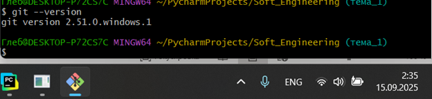
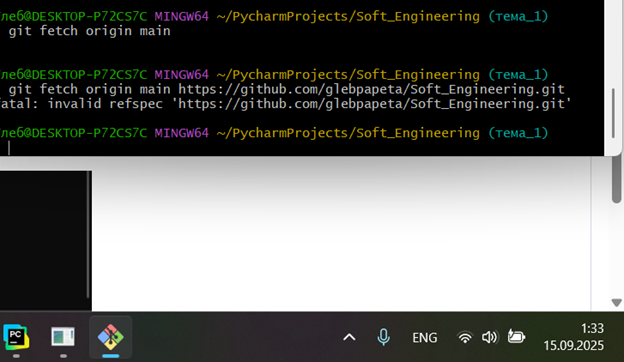

# Тема 1. Введение в Python.
Отчет по Теме 1 выполнил:

* Папета Глеб Павлович 
* АИС-23-1

| Задание | Лаб_раб |
|---|---|
| Задание 1 | + | 
| Задание 2 | + | 
| Задание 3 | + | 
| Задание 4 | + | 
| Задание 5 | + | 
| Задание 6 | + | 
| Задание 7 | + | 
| Задание 8 | + | 
| Задание 9 | + | 
| Задание 10 | + |
| Задание 11 | + |
| Задание 12 | + |
| Задание 13 | + |
| Задание 14 | + |
| Задание 15 | + |

# Лабораторная работа №1.  
## 2.1. Установка

## 2.2. Настройка

## 2.3. Создание нового репозитория

## 2.4. Подготовка файлов

## 2.5. Фиксация изменений

## 2.6. Подключение к удаленному репозиторию

.png)

## 2.7. Ветвление

## 2.8. Особенности применения «Фетч»

## 2.9. Удаление файлов, веток, локальных и удалённых репозиториев

## 2.10. Отслеживание изменений в коммитах

## 2.11. Возвращение файла к предыдущему (определенному) состоянию

## 2.12. Возвращение к предыдущему коммиту

## 2.13. Исправление коммита

.png)

## 2.14. Разрешение конфликтов при слиянии

# 2.15. Настройка .gitignore

# Вывод 
В данной лабораторной работе я смог научиться основам github: работать с файлами, ветками, работать с локальными и удаленными репозиториями и писать .md-файлы.
