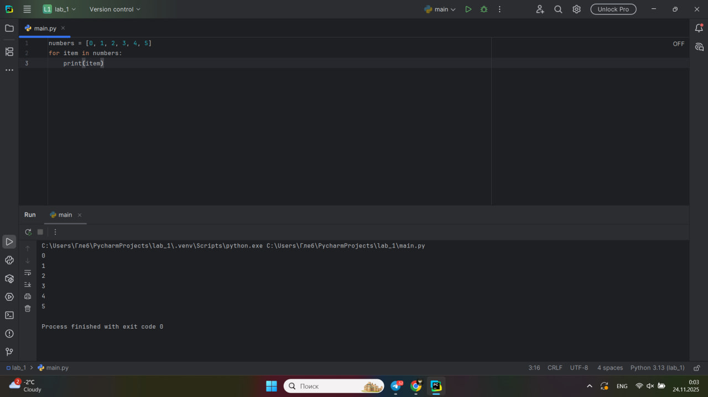
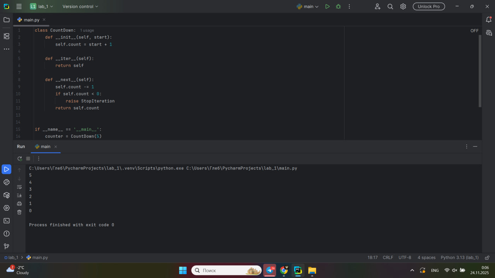
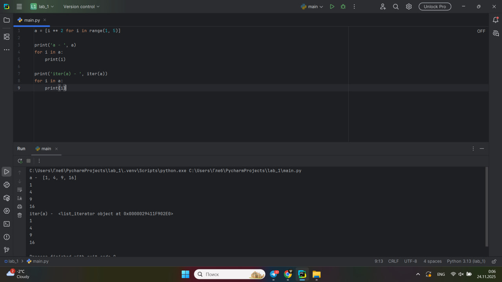
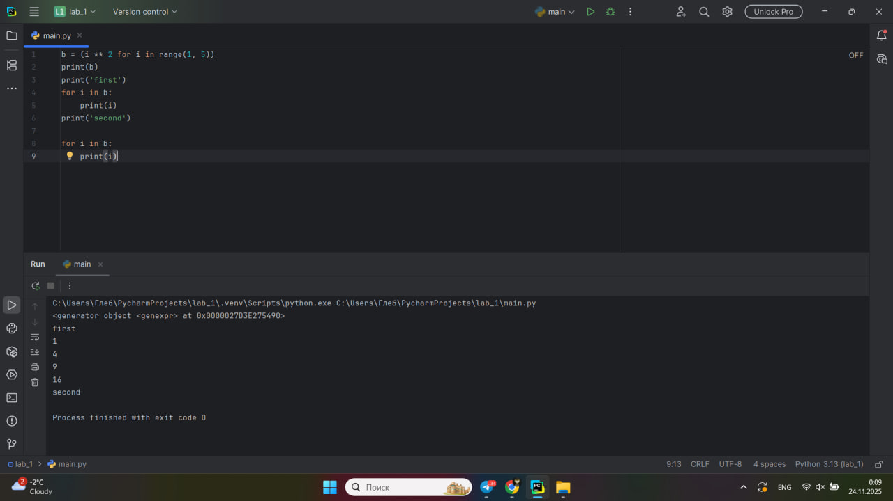
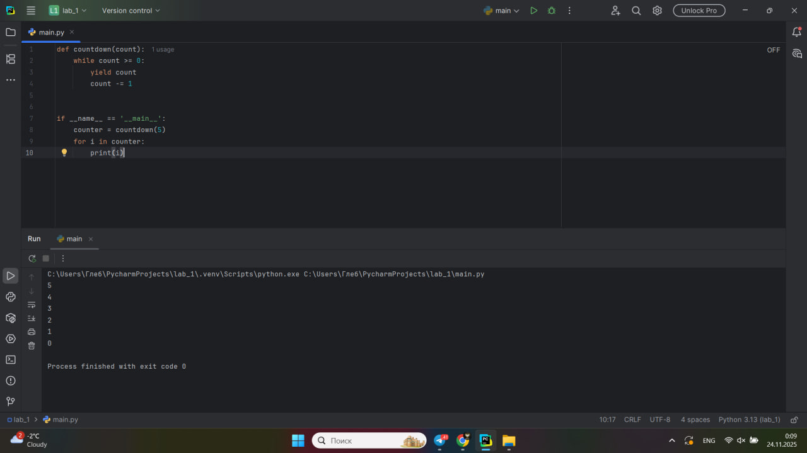
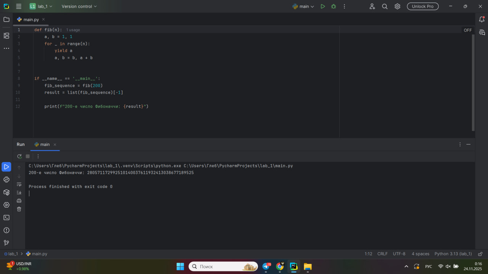
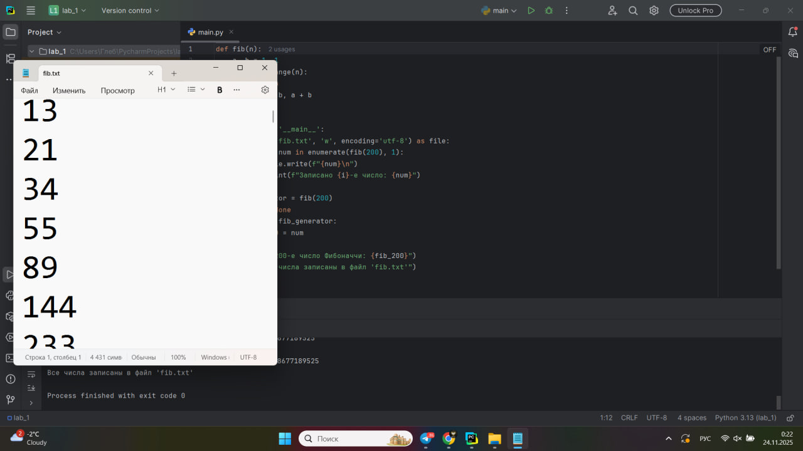

# Тема 11. Итераторы и генераторы.
Отчёт по Теме 11 выполнил:
- Папета Глеб Павлович
- Группа: АИС-23-1
  
| Задание     | Лаб_Раб     | Сам_Раб     | 
| ----------- | ----------- | ----------- |
|  Задание 1  |     +       |      +      |
|  Задание 2  |     +       |      +      | 
|  Задание 3  |     +       |             
|  Задание 4  |     +       |             
|  Задание 5  |     +       |              

## Лабораторные работа 1
# Простой итератор, но у него нет гибкой настройки, например его нельзя развернуть. Он работает просто как next(), но нет prev()

```python
numbers = [0, 1, 2, 3, 4, 5]
for item in numbers:
    print(item)
```
### Результат


### Выводы

Простые итераторы в Python удобны для базовой итерации по коллекциям, но имеют ограниченную функциональность. Они позволяют последовательно получать элементы, но не поддерживают обратное движение или сложные операции с итерацией.

## Лабораторные работа 2
# Класс итератор с гибкой настройкой и удобными применением

```python
class CountDown:
    def __init__(self, start):
        self.count = start + 1

    def __iter__(self):
        return self

    def __next__(self):
        self.count -= 1
        if self.count < 0:
            raise StopIteration
        return self.count


if __name__ == '__main__':
    counter = CountDown(5)
    for i in counter:
        print(i)
```

### Результат


### Выводы

Классы-итераторы предоставляют гибкость в настройке логики итерации. Реализуя методы __iter__() и __next__(), можно создавать кастомные итераторы с любой нужной логикой перебора элементов.

## Лабораторные работа 3
# Генератор текста 
```python
a = [i ** 2 for i in range(1, 5)]

print('a - ', a)
for i in a:
    print(i)

print('iter(a) - ', iter(a))
for i in a:
    print(i)
```
### Результат


### Выводы

Генераторы списков (list comprehensions) - мощный инструмент Python для создания коллекций. Они сочетают лаконичный синтаксис с высокой производительностью, позволяя создавать списки в одну строку с применением преобразований к элементам.

## Лабораторные работа 4
# Выражения генараторы 
```python
b = (i ** 2 for i in range(1, 5))
print(b)
print('first')
for i in b:
    print(i)
print('second')

for i in b:
    print(i)
```

### Результат


### Выводы

Выражения-генераторы (generator expressions) отличаются от генераторов списков тем, что не создают всю коллекцию сразу, а генерируют элементы по требованию. Это экономит память, но делает их одноразовыми - после первого прохода генератор истощается.

## Лабораторные работа 5
# Такой же счетчик, как и в первом задании, только это генератор и использует yield
```python
def countdown(count):
    while count >= 0:
        yield count
        count -= 1


if __name__ == '__main__':
    counter = countdown(5)
    for i in counter:
        print(i)
```
### Результат


### Выводы

Функции-генераторы с использованием yield сочетают простоту использования с эффективностью. Они сохраняют состояние между вызовами и генерируют значения по одному, что делает их идеальными для работы с большими последовательностями данных.

## Самостоятельная работа 1
# Вас никак не могут оставить числа Фибоначчи, очень уж они вас  заинтересовали. Изучив новые возможности Python вы решили  реализовать программу, которая считает числа Фибоначчи при  помощи итераторов. Расчет начинается с чисел 1 и 1. Создайте  функцию fib(n), генерирующую n чисел Фибоначчи с  минимальными затратами ресурсов. Для реализации этой функции  потребуется обратиться к инструкции yield (Она не сохраняет в  оперативной памяти огромную последовательность, а дает  возможность “доставать” промежуточные результаты по одному).  Результатом решения задачи будет листинг кода и вывод в консоль с  числом Фибоначчи от 200
```python
def fib(n):
    a, b = 1, 1
    for _ in range(n):
        yield a
        a, b = b, a + b


if __name__ == '__main__':
    fib_sequence = fib(200)
    result = list(fib_sequence)[-1]

    print(f"200-е число Фибоначчи: {result}")
```
### Результат


### Выводы

Генераторы особенно полезны для работы с бесконечными или очень большими последовательностями, такими как числа Фибоначчи. Использование yield позволяет вычислять элементы по требованию без хранения всей последовательности в памяти.

## Самостоятельная работа 2
# К коду предыдущей задачи добавьте запоминание каждого числа  Фибоначчи в файл “fib.txt”, при этом каждое число должно  находиться на отдельной строчке. Результатом выполнения задачи  будет листинг кода и скриншот получившегося файла
```python
def fib(n):
    a, b = 1, 1
    for _ in range(n):
        yield a
        a, b = b, a + b


if __name__ == '__main__':
    with open('fib.txt', 'w', encoding='utf-8') as file:
        for i, num in enumerate(fib(200), 1):
            file.write(f"{num}\n")
            print(f"Записано {i}-е число: {num}")

    fib_generator = fib(200)
    fib_200 = None
    for num in fib_generator:
        fib_200 = num

    print(f"\n200-е число Фибоначчи: {fib_200}")
    print("Все числа записаны в файл 'fib.txt'")
```
### Результат


### Выводы

Сочетание генераторов с работой с файлами позволяет эффективно обрабатывать большие объемы данных. Генератор поставляет числа по одному, а файловая операция записывает их немедленно, что минимизирует использование оперативной памяти.

### Общий вывод

Итераторы и генераторы - мощные инструменты Python для работы с последовательностями данных. Основные преимущества:

Экономия памяти - генераторы создают элементы по требованию, а не хранят всю последовательность

Гибкость - кастомные итераторы позволяют реализовать любую логику перебора

Удобство - встроенные итераторы и генераторы списков делают код лаконичным

Производительность - ленивые вычисления экономят ресурсы

Генераторы особенно полезны при работе с большими данными, бесконечными последовательностями и потоковой обработкой. Сочетание генераторов с файловыми операциями и другими инструментами Python создает эффективные и масштабируемые решения.


### Общий вывод
