# Тема 2. Базовые операции языка Python
Отчет по Теме #2 выполнил(а):
- Папета Глеб Павлович
- АИС-23-1

| Задание | Лаб_раб | Сам_раб |
| ------ | ------ | ------ |
| Задание 1 | + | + |
| Задание 2 | + | + |
| Задание 3 | + | + |
| Задание 4 | + | + |
| Задание 5 | + | + |
| Задание 6 | + | + |
| Задание 7 | + | + |
| Задание 8 | + | + |
| Задание 9 | + | + |
| Задание 10 | + | + |

знак "+" - задание выполнено; знак "-" - задание не выполнено;


## Лабораторная работа №1
### Выведите в консоль три строки. Первая – любое число. Вторая – любое число в виде строки. Третья – любое число с плавающей точкой.

```python
print(123)
print('123')
print(1.23)
```
### Результат.
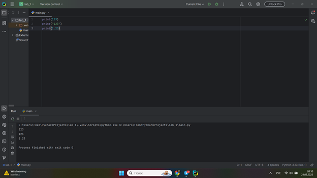

## Выводы

В данном коде выводятся три строки с использованием функции `print()`. Каждая строка содержит разные значения:

1. `print(123)`: Выводится целое число 123. Это число не взаимодействует со строковыми операциями и выводится как есть.

2. `print('123')`: Выводится строка '123', так как она заключена в одинарные кавычки. В этом случае это текстовая строка, а не число.

3. `print(1.23)`: Выводится число с плавающей точкой 1.23. Так же, как и в первом случае, оно выводится как числовое значение.

## Лабораторная работа №2
### Выведите в консоль три строки. Первая – результат сложения или вычитания минимум двух переменных типа int. Вторая – результат сложения или вычитания минимум двух переменных типа float. Третья – результат сложения или вычитания минимум двух переменных типа int и float.
```python
print(1234 - 1116)
print(1.22 + 3.16)
print(1.23 + 7 - 8.8 + 16)
```
### Результат.
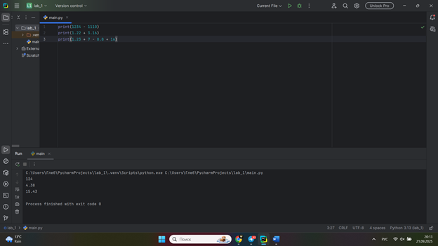
- Краткие Выводы

## Лабораторная работа №3
### Выведите в консоль три строки. Первая – результат сложения или вычитания минимум двух переменных типа int. Вторая – результат сложения или вычитания минимум двух переменных типа float. Третья – результат сложения или вычитания минимум двух переменных типа int и float.
```python
print('Привет, Мир!')

world = 'Мир'
print(f"Привет, {world}!")

one = 'Привет,'
two = 'Мир!'
print(one+two)
```
### Результат.
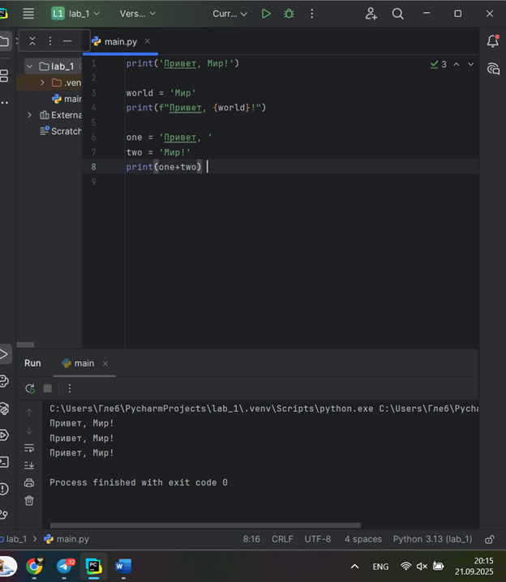
- Краткие Выводы
  
## Лабораторная работа №4
### Выведите в консоль три строки. Первая – трансформация любого типа переменной в bool. Вторая – трансформация любого типа переменной в float или int. Третья – трансформация любого типа переменной в str
```python
one = 'Hello'
print(bool(one))

two = 865
print(float(two))

three = None
print(str(three))
```
### Результат.
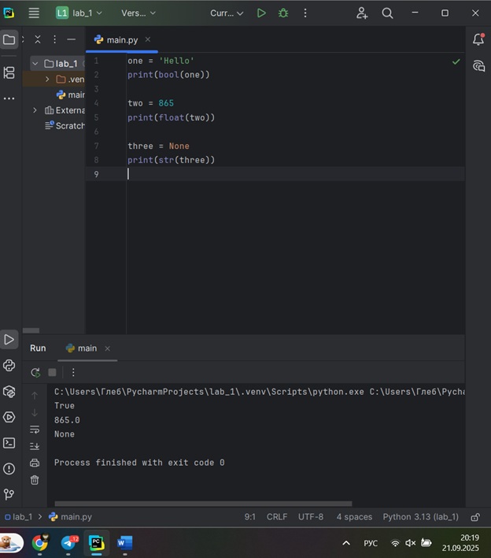
- Краткие Выводы

## Лабораторная работа №5
### Присвойте трем переменным различные значения, воспользовавшись функцией input()
```python
one = input('one:')
two = input('two:')
three = input('three:')
print(one, two, three)
```
### Результат.
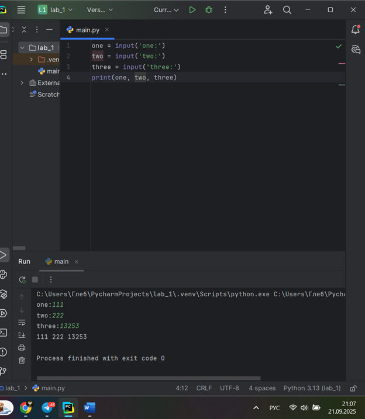
- Краткие Выводы

## Лабораторная работа №6
### Создайте две любые числовые переменные и выполните над ними несколько математических операций: возведение в степень, обычное деление, целочисленное деление, нахождение остатка от деления. При желании вы можете проверить как работают эти вычисления с разными типами данных, например, сначала создать две переменные int, затем создать две переменные float и наконец создать переменные типа int и float и провести над ними операции, прописанные выше.
```python
a = 8
b = 5
print('Возведение в степень:', a ** b)
print('Обычное деление:', a / b)
print('Целочисленное деление:', a // b)
print('Нахождение остатка от деления:', a % b)
```
### Результат.
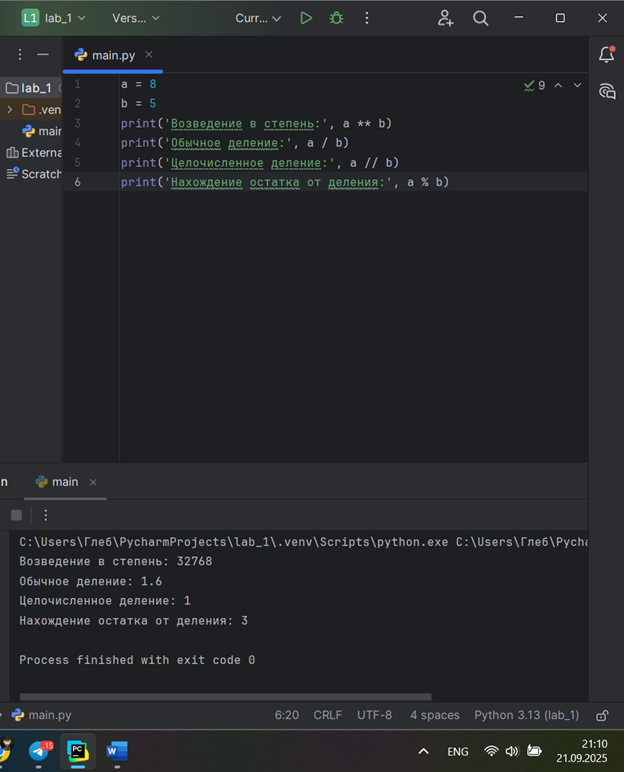
- Краткие Выводы

## Лабораторная работа №7
### Создайте любую строковую переменную и произведите над ней математическое действие умножение на любое число.
```python
line = 'Hi!'
print(line * 6)
```
### Результат.
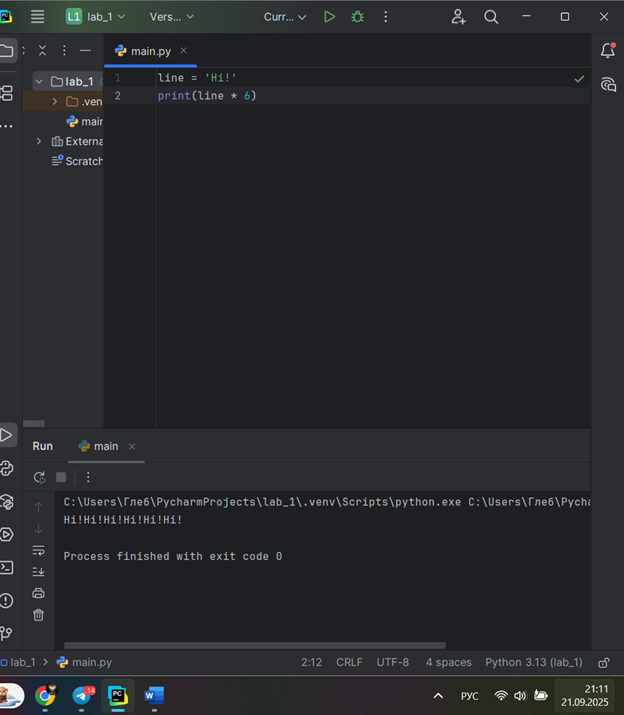
- Краткие Выводы

## Лабораторная работа №8
### Посчитайте сколько раз символ ‘o’ встречается в строке ‘Hello World’.
```python
sentence = 'Hello world!'
print(sentence.count('o'))
```
### Результат.
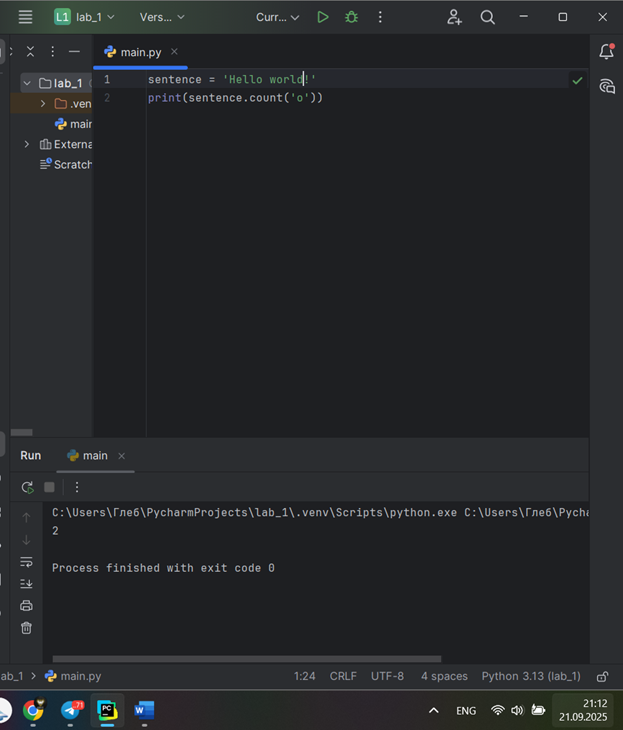
- Краткие Выводы

## Лабораторная работа №9
### Напишите предложение ‘Hello World’ в две строки. Написанная программа должна занимать одну строку в редакторе кода
```python
print('Hello\nWorld')
```
### Результат.
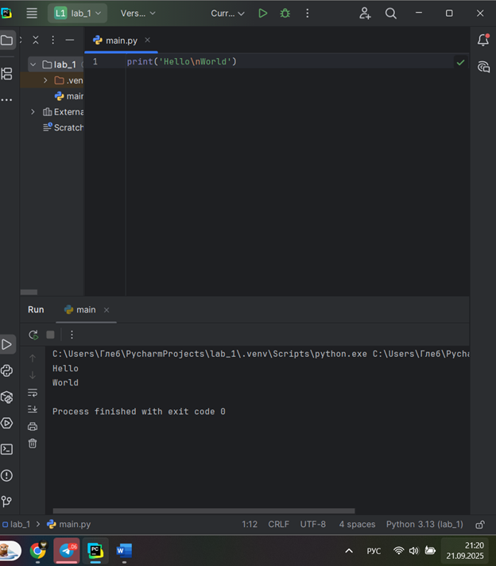
- Краткие Выводы

## Лабораторная работа №10
### Из предложения ‘Hello World’ выведите в консоль только 2 символ, а затем выведите слово ‘Hello’
```python
sentence = 'Hello World'
print(sentence[1])
print(sentence[:5])
```
### Результат.
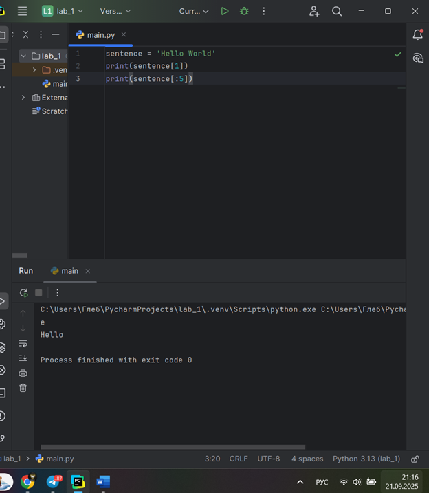
- Краткие Выводы

## Самостоятельная работа №1
### Выведите в консоль булевую переменную False, не используя слово False в строке или изначально присвоенную булевую переменную. Программа должна занимать не более двух строк редактора кода
```python
print( 1 == 0)
```
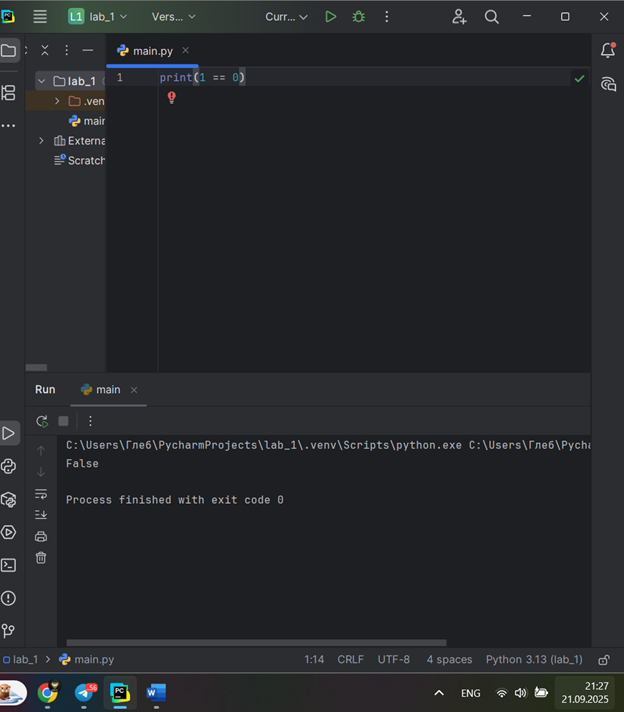
- Развернутый вывод
  
## Самостоятельная работа №2
### Присвоить значения трем переменным и вывести их в консоль, используя только две строки редактора кода
```python
a, b, c = 1, 2, 3
print(a, b, c)
```
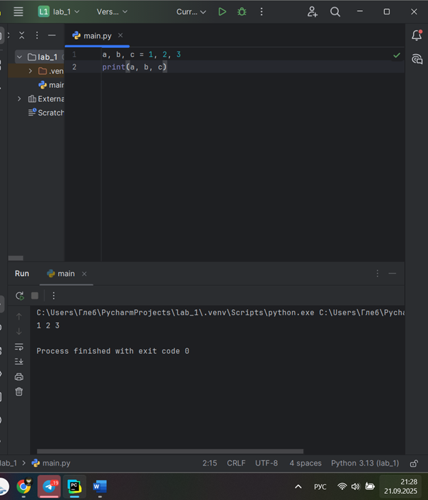
- Развернутый вывод
  
## Самостоятельная работа №3
### Реализуйте ввод данных в программу, через консоль, в виде только целых чисел (тип данных int). То есть при вводе буквенных символов в консоль, программа не должна работать. Программа должна занимать не более двух строк редактора кода.
```python
a = int(input())
print(a)
```
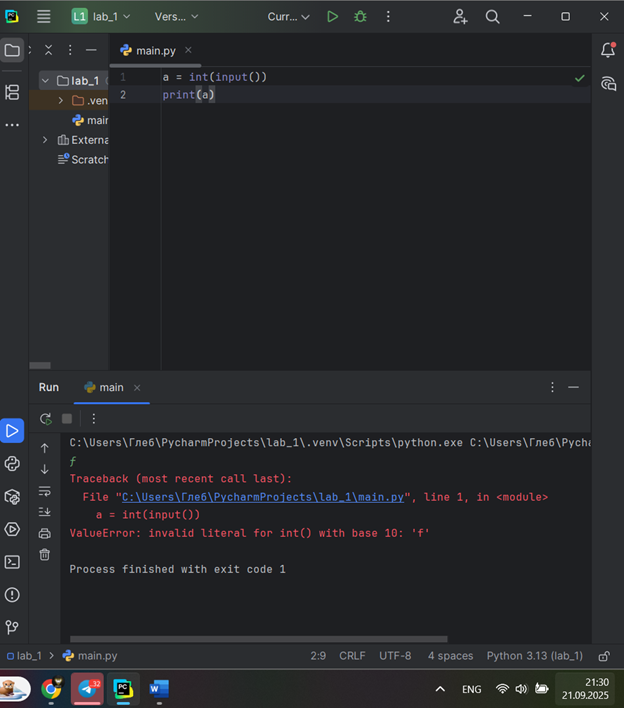
- Развернутый вывод
  
## Самостоятельная работа №4
### Создайте только одну строковую переменную. Длина строки должна не превышать 5 символов. На выходе мы должны получить строку длиной не менее 16 символов. Программа должна занимать не более двух строк редактора кода.
```python
s = "a"
print(s * 16)
```
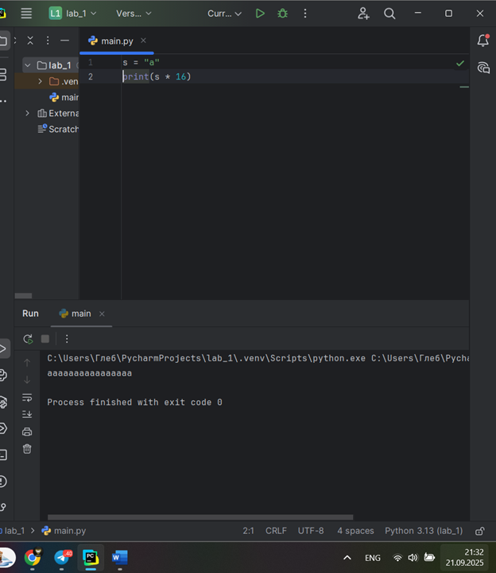
- Развернутый вывод
  
## Самостоятельная работа №5
### Создайте три переменные: день (тип данных - числовой), месяц (тип данных - строка), год (тип данных - числовой) и выведите в консоль текущую дату в формате: “Сегодня день месяц год. Всего хорошего!” используя F строку и оператор end внутри print(), в котором вы должны написать фразу “Всего хорошего!”. Программа должна занимать не более двух строк редактора кода.
```python
day, month, year = 21, "сентября", 2025
print(f"Сегодня {day} {month} {year}. ", end="Всего хорошего!")
```
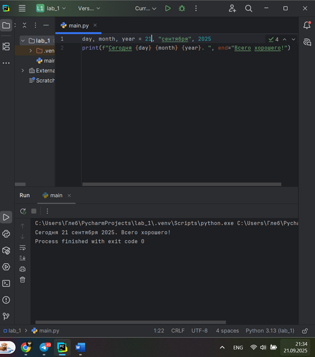
- Развернутый вывод
  
## Самостоятельная работа №6
### В предложении ‘Hello World’ вставьте ‘my’ между двумя словами. Выведите полученное предложение в консоль в одну строку. Программа должна занимать не более двух строк редактора кода.
```python
s = 'Hello World'
print(s.replace(' ', ' my '))
```
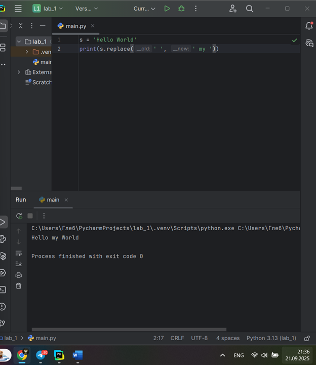
- Развернутый вывод
  
## Самостоятельная работа №7
### Узнайте длину предложения ‘Hello World’, результат выведите в консоль. Программа должна занимать не более двух строк редактора кода
```python
print(len('Hello World'))
```
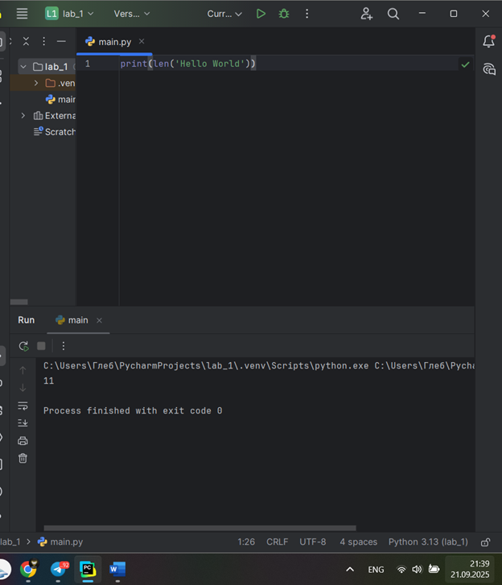
- Развернутый вывод
  
## Самостоятельная работа №8
### Переведите предложение ‘HELLO WORLD’ в нижний регистр. Программа должна занимать не более двух строк редактора кода.
```python
s = 'HELLO WORLD'
print(s.lower())
```
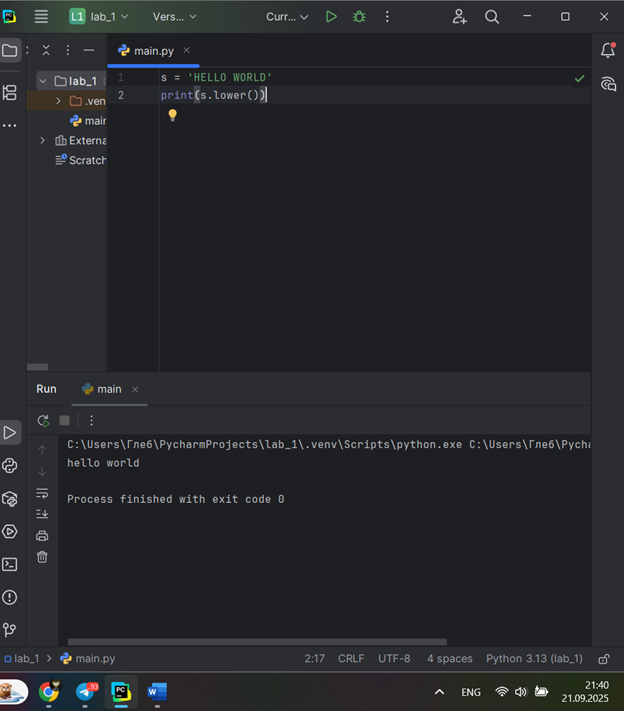
- Развернутый вывод
  
## Самостоятельная работа №9
### Самостоятельно придумайте задачу по проходимой теме и решите ее. Задача должна быть связана со взаимодействием с числовыми значениями
```python
a, b = 6, 8
print(f"Площадь треугольника: {0.5 * a * b}")
```
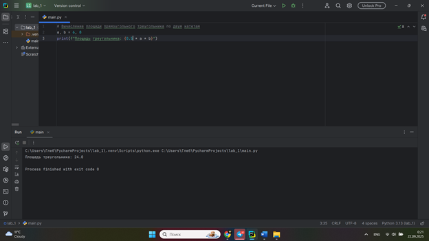
- Развернутый вывод
  
## Самостоятельная работа №10
### Самостоятельно придумайте задачу по проходимой теме и решите ее. Задача должна быть связанна со взаимодействием со строковыми значениями.
```python
sentence = 'Hello World'
print(sentence[1])
print(sentence[:5])
```
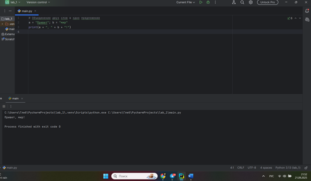
- Развернутый вывод

## Общие выводы по теме
- Развернутый вывод
