# Тема 4. Функции и стандартные модули/библиотеки
Отчет по Теме #4 выполнил(а):
- Папета Глеб Павлович
- АИС-23-1

| Задание | Лаб_раб | Сам_раб |
| ------ | ------ | ------ |
| Задание 1 | + | + |
| Задание 2 | + | + |
| Задание 3 | + | + |
| Задание 4 | + | + |
| Задание 5 | + | + |
| Задание 6 | + | 
| Задание 7 | + | 
| Задание 8 | + | 
| Задание 9 | + | 
| Задание 10 | + | 

знак "+" - задание выполнено; знак "-" - задание не выполнено;


## Лабораторная работа №1
### Напишите функцию, которая выполняет любые арифметические действия и выводит результат в консоль. Вызовите функцию, используя “точку входа”.

```python
def main():
    print(2 + 2)

if __name__ == '__main__':
    main()

```
### Результат.
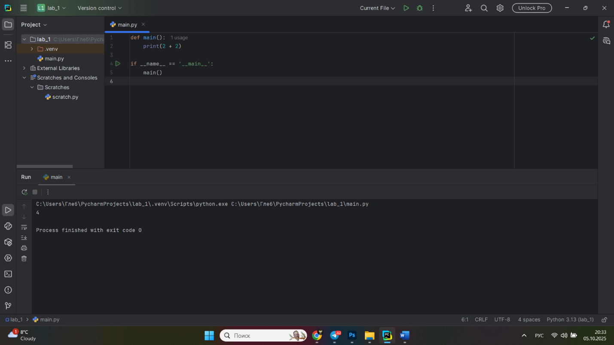

## Выводы
Простая функция с непосредственным выводом результата
Создана базовая функция main(), которая выполняет арифметическое сложение (2 + 2) и сразу выводит результат в консоль с помощью print(). Демонстрируется использование "точки входа" if __name__ == '__main__': для корректного вызова функции при непосредственном запуске скрипта.

## Лабораторная работа №2
### Напишите функцию, которая выполняет любые арифметические действия, возвращает при помощи return значение в место, откуда вызывали функцию. Выведите результат в консоль. Вызовите функцию, используя “точку входа”.
```python
def main():
    return 2 + 2

if __name__ == '__main__':
    print(main())

```
```python
def main():
    result = 2 + 2
    return result

if __name__ == '__main__':
    answer = main()
    print(answer)
```

### Результат.
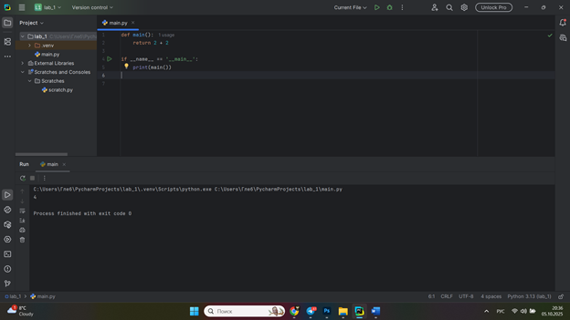
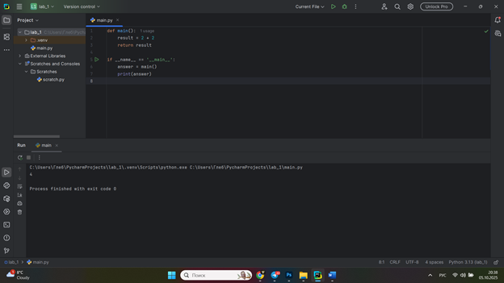
## Выводы
Функция с возвратом значения через return
Реализована функция, которая выполняет вычисления и возвращает результат с помощью оператора return. Показаны два варианта обработки возвращаемого значения: непосредственный вывод print(main()) и сохранение в переменную answer = main() с последующим выводом.

## Лабораторная работа №3
### Напишите функцию, в которую передаются два аргумента, над ними производится арифметическое действие, результат возвращается туда, откуда эту функцию вызывали.Выведите результат в консоль. Вызовите функцию в любом небольшом цикле.
```python
def main(one, two):
    result = one + two
    return result

for i in range(5):
    x = 1
    y = 10
    answer = main(x, y)
    print(answer)

```
```python
def main(one, two):
    return one + two

for i in range(5):
    answer = main(one=1, two=10)
    print(answer)

```    

### Результат.
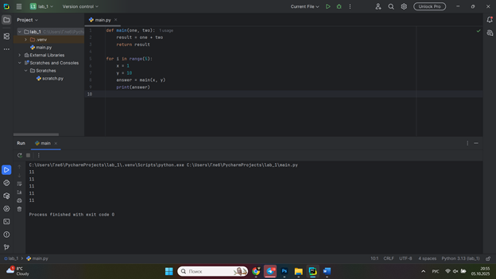

## Выводы
Функция с параметрами и вызов в цикле
Функция принимает два аргумента one и two, выполняет над ними арифметическую операцию и возвращает результат. Демонстрируется вызов функции в цикле for с передачей различных значений. Показаны два стиля передачи аргументов: позиционный и именованный.

## Лабораторная работа №4
### Напишите функцию, на вход которой подается какое-то изначально неизвестное количество аргументов, над которыми будут производиться арифметические действия. Для выполнения задания необходимо использовать кортеж *args.
```python
def main(x, *args):
    one = x
    two = sum(args)
    three = float(one + two) / len(args)
    print(f"one={one}\ntwo={two}\nthree={three}")
    return x + sum(args) / float(len(args))

if __name__ == '__main__':
    print(main(1, 0, 2, -1, 0, -1, 1, 2))


```
### Результат.
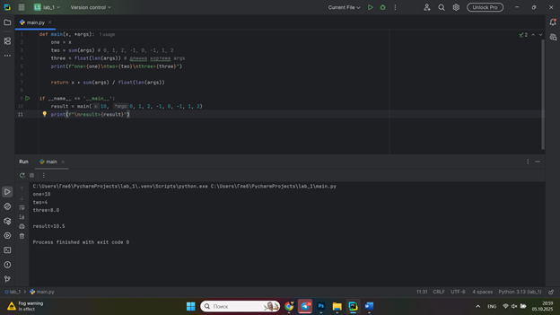
## Выводы
Функция использует кортеж *args для получения произвольного количества аргументов. Реализованы различные вычисления: сумма дополнительных аргументов, среднее арифметическое. Показана работа с кортежем через функции sum() и len().


## Лабораторная работа №5
### Напишите функцию, которая на вход получает кортеж **kwargs и при помощи цикла выводит значения, поступившие в функцию.
```python
def main(**kwargs):
    for i in kwargs.items():
        print(i[0], i[1])

    print()

    for key in kwargs:
        print(f"{key} = {kwargs[key]}")

if __name__ == '__main__':
    main(x=[1,2, 3], y=[3,3, 2], z=[2,3,0], q=[3,3, 0], w=[3,3,0])
    print()
    main(**{'x': [1, 2, 3], 'y': [3, 3, 0]})

```
### Результат.
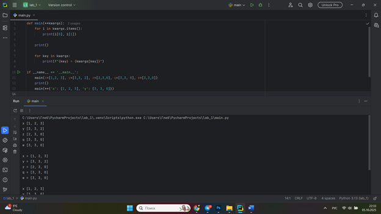
## Выводы
Функция принимает словарь именованных аргументов **kwargs и выводит их содержимое с использованием двух различных подходов: метод items() и прямой перебор ключей с доступом к значениям через kwargs.


## Лабораторная работа №6
### Напишите две функции. Первая — получает в виде параметра **kwargs. Вторая — считает среднее арифметическое из значений первой функции. Вызовите первую функцию, используя “точку входа”, и минимум 4 аргумента.
```python
def main(**kwargs):
    
    for i, j in kwargs.items():
        print(f"{i}. Mean = {mean(j)}")

def mean(data):
    
    return sum(data) / float(len(data))

if __name__ == '__main__':
    main(x=[1, 2, 3], y=[3, 0])

```
### Результат.
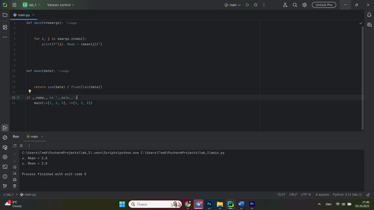
## Выводы
Созданы две функции: первая получает данные через **kwargs и вызывает вторую функцию для вычисления среднего арифметического, вторая функция специализируется на математических вычислениях. Демонстрируется принцип разделения ответственности между функциями.

## Лабораторная работа №7
### Создайте дополнительный файл .py. Напишите в нем любую функцию, которая будет что угодно выводить в консоль, но не вызывайте её в этом файле.
```python
def say_hello():
    print('Hello students!')


from for_import import say_hello

if __name__ == '__main__':
    say_hello()

```
### Результат.
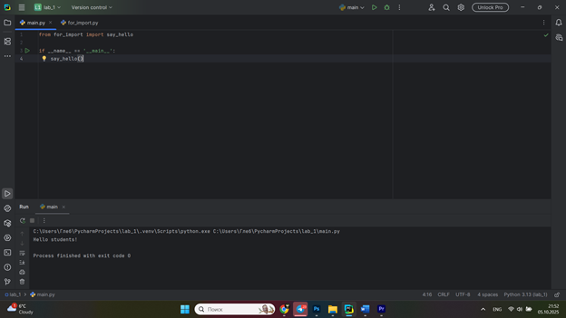
## Выводы
Модульная архитектура и импорт функций
Показана организация кода в несколько файлов. Функция say_hello() определена в отдельном модуле for_import.py и импортируется в основной скрипт. Демонстрируются основы модульности и повторного использования кода.

## Лабораторная работа №8
### Напишите программу, которая будет выводить корень, синус и косинус числа, введённого пользователем.
```python
import math

def main():
    value = int(input('Введите значение: '))
    print(math.sqrt(value))
    print(math.sin(value))
    print(math.cos(value))

if __name__ == '__main__':
    main()

```
```python
import math import sqrt, sin, cos

def main():
    value = int(input('Введите значение: '))
    print(sqrt(value))
    print(sin(value))
    print(cos(value))

if __name__ == '__main__':
    main()

```
```python

```
### Результат.
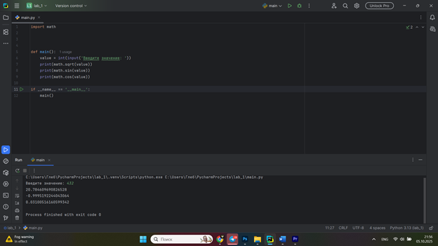
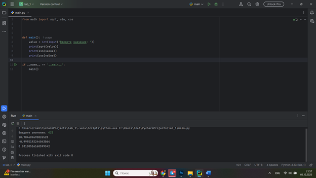
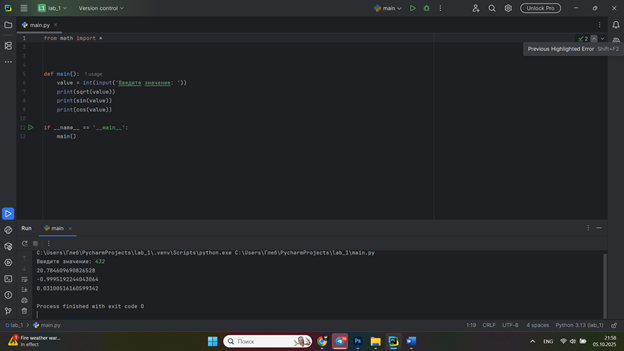
## Выводы
Использование математического модуля math
Программа вычисляет математические функции (квадратный корень, синус, косинус) для числа, введенного пользователем. Показаны три варианта импорта: полный импорт модуля, выборочный импорт функций и импорт с псевдонимом.

## Лабораторная работа №9
### Напишите программу, которая будет рассчитывать, какой день недели будет через n-нное количество дней, введённых пользователем.
```python
from datetime import datetime as dt
from datetime import timedelta as td

def main():
    print(
        f"Сегодня {dt.today().date()}. "
        f"День недели - {dt.today().isoweekday()}"
    )
    n = int(input('Введите количество дней: '))
    today = dt.today()
    result = today + td(days=n)
    print(
        f"Через {n} дней будет {result.date()}. "
        f"День недели - {result.isoweekday()}"
    )

if __name__ == '__main__':
        main()


```
### Результат.
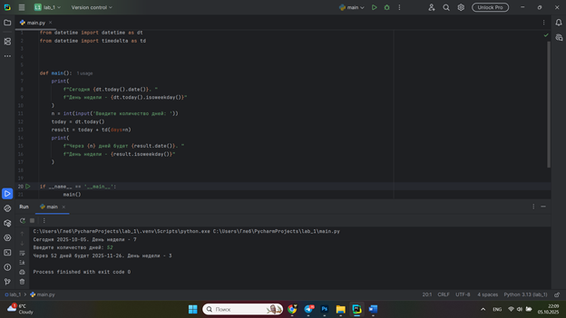
## Выводы
Работа с датами и временем
Программа рассчитывает будущую дату и день недели через указанное пользователем количество дней. Используются модули datetime и timedelta для работы с датами. Демонстрируются методы получения текущей даты и выполнения арифметических операций с датами.

## Лабораторная работа №10
### Напишите программу с использованием глобальных переменных, которая будет считать площадь треугольника или прямоугольника — в зависимости от того, что выберет пользователь.
```python
global result

def rectangle():
    a = float(input("Ширина: "))
    b = float(input("Высота: "))
    global result
    result = a * b

def triangle():
    a = float(input("Основание: "))
    h = float(input("Высота: "))
    global result
    result = 0.5 * a * h

```
### Результат.
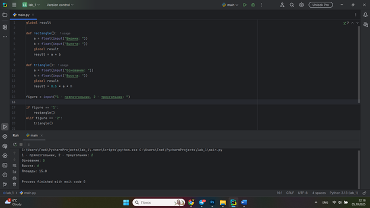
## Выводы
Использование глобальных переменных
Созданы две функции для вычисления площади прямоугольника и треугольника, которые используют глобальную переменную result для хранения результата. Показан подход с использованием глобальных переменных для обмена данными между функциями, а также организация интерактивного ввода данных от пользователя.

## Самостоятельная работа №1
### 
```python

```

## Выводы

  
## Самостоятельная работа №2
### 

```python

```

## Выводы


## Самостоятельная работа №3
### 
```python

```

## Выводы


  
## Самостоятельная работа №4
### 
```python

```


## Выводы


## Самостоятельная работа №5
### 
```python

```

## Выводы


## Общие выводы по теме
программных алгоритмов для генерации определенных последовательностей вывода. Практика показала важность точного следования условиям задачи и тщательной проверки работы программы на соответствие ожидаемому результату.
