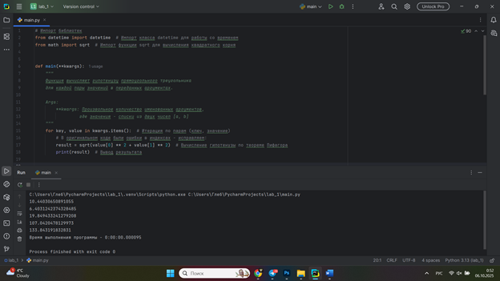
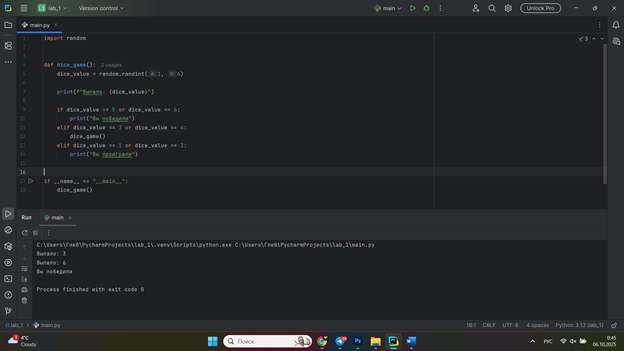
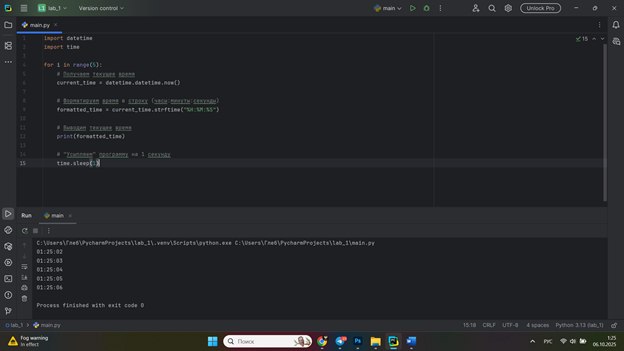
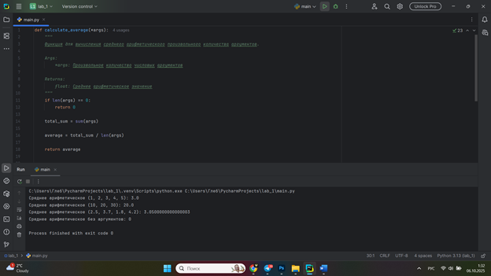
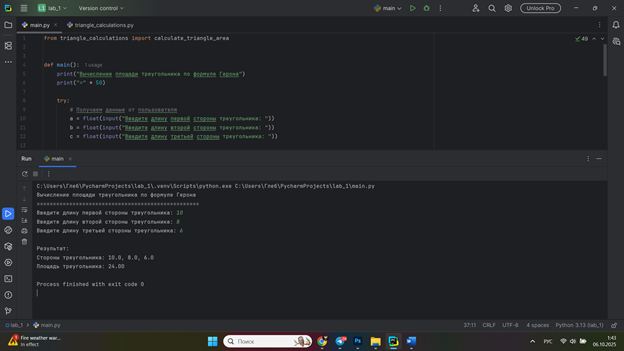

# Тема 4. Функции и стандартные модули/библиотеки
Отчет по Теме #4 выполнил(а):
- Папета Глеб Павлович
- АИС-23-1

| Задание | Лаб_раб | Сам_раб |
| ------ | ------ | ------ |
| Задание 1 | + | + |
| Задание 2 | + | + |
| Задание 3 | + | + |
| Задание 4 | + | + |
| Задание 5 | + | + |
| Задание 6 | + | 
| Задание 7 | + | 
| Задание 8 | + | 
| Задание 9 | + | 
| Задание 10 | + | 

знак "+" - задание выполнено; знак "-" - задание не выполнено;


## Лабораторная работа №1
### Напишите функцию, которая выполняет любые арифметические действия и выводит результат в консоль. Вызовите функцию, используя “точку входа”.

```python
def main():
    print(2 + 2)

if __name__ == '__main__':
    main()

```
### Результат.


## Выводы
Простая функция с непосредственным выводом результата
Создана базовая функция main(), которая выполняет арифметическое сложение (2 + 2) и сразу выводит результат в консоль с помощью print(). Демонстрируется использование "точки входа" if __name__ == '__main__': для корректного вызова функции при непосредственном запуске скрипта.

## Лабораторная работа №2
### Напишите функцию, которая выполняет любые арифметические действия, возвращает при помощи return значение в место, откуда вызывали функцию. Выведите результат в консоль. Вызовите функцию, используя “точку входа”.
```python
def main():
    return 2 + 2

if __name__ == '__main__':
    print(main())

```
```python
def main():
    result = 2 + 2
    return result

if __name__ == '__main__':
    answer = main()
    print(answer)
```

### Результат.


## Выводы
Функция с возвратом значения через return
Реализована функция, которая выполняет вычисления и возвращает результат с помощью оператора return. Показаны два варианта обработки возвращаемого значения: непосредственный вывод print(main()) и сохранение в переменную answer = main() с последующим выводом.

## Лабораторная работа №3
### Напишите функцию, в которую передаются два аргумента, над ними производится арифметическое действие, результат возвращается туда, откуда эту функцию вызывали.Выведите результат в консоль. Вызовите функцию в любом небольшом цикле.
```python
def main(one, two):
    result = one + two
    return result

for i in range(5):
    x = 1
    y = 10
    answer = main(x, y)
    print(answer)

```
```python
def main(one, two):
    return one + two

for i in range(5):
    answer = main(one=1, two=10)
    print(answer)

```    

### Результат.


## Выводы
Функция с параметрами и вызов в цикле
Функция принимает два аргумента one и two, выполняет над ними арифметическую операцию и возвращает результат. Демонстрируется вызов функции в цикле for с передачей различных значений. Показаны два стиля передачи аргументов: позиционный и именованный.

## Лабораторная работа №4
### Напишите функцию, на вход которой подается какое-то изначально неизвестное количество аргументов, над которыми будут производиться арифметические действия. Для выполнения задания необходимо использовать кортеж *args.
```python
def main(x, *args):
    one = x
    two = sum(args)
    three = float(one + two) / len(args)
    print(f"one={one}\ntwo={two}\nthree={three}")
    return x + sum(args) / float(len(args))

if __name__ == '__main__':
    print(main(1, 0, 2, -1, 0, -1, 1, 2))


```
### Результат.

## Выводы
Функция использует кортеж *args для получения произвольного количества аргументов. Реализованы различные вычисления: сумма дополнительных аргументов, среднее арифметическое. Показана работа с кортежем через функции sum() и len().


## Лабораторная работа №5
### Напишите функцию, которая на вход получает кортеж **kwargs и при помощи цикла выводит значения, поступившие в функцию.
```python
def main(**kwargs):
    for i in kwargs.items():
        print(i[0], i[1])

    print()

    for key in kwargs:
        print(f"{key} = {kwargs[key]}")

if __name__ == '__main__':
    main(x=[1,2, 3], y=[3,3, 2], z=[2,3,0], q=[3,3, 0], w=[3,3,0])
    print()
    main(**{'x': [1, 2, 3], 'y': [3, 3, 0]})

```
### Результат.

## Выводы
Функция принимает словарь именованных аргументов **kwargs и выводит их содержимое с использованием двух различных подходов: метод items() и прямой перебор ключей с доступом к значениям через kwargs.


## Лабораторная работа №6
### Напишите две функции. Первая — получает в виде параметра **kwargs. Вторая — считает среднее арифметическое из значений первой функции. Вызовите первую функцию, используя “точку входа”, и минимум 4 аргумента.
```python
def main(**kwargs):
    
    for i, j in kwargs.items():
        print(f"{i}. Mean = {mean(j)}")

def mean(data):
    
    return sum(data) / float(len(data))

if __name__ == '__main__':
    main(x=[1, 2, 3], y=[3, 0])

```
### Результат.

## Выводы
Созданы две функции: первая получает данные через **kwargs и вызывает вторую функцию для вычисления среднего арифметического, вторая функция специализируется на математических вычислениях. Демонстрируется принцип разделения ответственности между функциями.

## Лабораторная работа №7
### Создайте дополнительный файл .py. Напишите в нем любую функцию, которая будет что угодно выводить в консоль, но не вызывайте её в этом файле.
```python
def say_hello():
    print('Hello students!')


from for_import import say_hello

if __name__ == '__main__':
    say_hello()

```
### Результат.

## Выводы
Модульная архитектура и импорт функций
Показана организация кода в несколько файлов. Функция say_hello() определена в отдельном модуле for_import.py и импортируется в основной скрипт. Демонстрируются основы модульности и повторного использования кода.

## Лабораторная работа №8
### Напишите программу, которая будет выводить корень, синус и косинус числа, введённого пользователем.
```python
import math

def main():
    value = int(input('Введите значение: '))
    print(math.sqrt(value))
    print(math.sin(value))
    print(math.cos(value))

if __name__ == '__main__':
    main()

```
```python
import math import sqrt, sin, cos

def main():
    value = int(input('Введите значение: '))
    print(sqrt(value))
    print(sin(value))
    print(cos(value))

if __name__ == '__main__':
    main()

```
```python
from math import *

def main():
    value = int(input('Введите значение: '))
    print(sqrt(value))
    print(sin(value))
    print(cos(value))

if __name__ == '__main__':
    main()

```
### Результат.


## Выводы
Использование математического модуля math
Программа вычисляет математические функции (квадратный корень, синус, косинус) для числа, введенного пользователем. Показаны три варианта импорта: полный импорт модуля, выборочный импорт функций и импорт с псевдонимом.

## Лабораторная работа №9
### Напишите программу, которая будет рассчитывать, какой день недели будет через n-нное количество дней, введённых пользователем.
```python
from datetime import datetime as dt
from datetime import timedelta as td

def main():
    print(
        f"Сегодня {dt.today().date()}. "
        f"День недели - {dt.today().isoweekday()}"
    )
    n = int(input('Введите количество дней: '))
    today = dt.today()
    result = today + td(days=n)
    print(
        f"Через {n} дней будет {result.date()}. "
        f"День недели - {result.isoweekday()}"
    )

if __name__ == '__main__':
        main()


```
### Результат.

## Выводы
Работа с датами и временем
Программа рассчитывает будущую дату и день недели через указанное пользователем количество дней. Используются модули datetime и timedelta для работы с датами. Демонстрируются методы получения текущей даты и выполнения арифметических операций с датами.

## Лабораторная работа №10
### Напишите программу с использованием глобальных переменных, которая будет считать площадь треугольника или прямоугольника — в зависимости от того, что выберет пользователь.
```python
global result

def rectangle():
    a = float(input("Ширина: "))
    b = float(input("Высота: "))
    global result
    result = a * b

def triangle():
    a = float(input("Основание: "))
    h = float(input("Высота: "))
    global result
    result = 0.5 * a * h

```
### Результат.

## Выводы
Использование глобальных переменных
Созданы две функции для вычисления площади прямоугольника и треугольника, которые используют глобальную переменную result для хранения результата. Показан подход с использованием глобальных переменных для обмена данными между функциями, а также организация интерактивного ввода данных от пользователя.

## Самостоятельная работа №1
### Дайте подробный комментарий для кода, написанного ниже. Комментарий нужен для каждой строчки кода, нужно описать что она делает. Не забудьте, что функции комментируются по-особенному.

```python
# Импорт библиотек
from datetime import datetime  # Импорт класса datetime для работы со временем
from math import sqrt  # Импорт функции sqrt для вычисления квадратного корня


def main(**kwargs):
    """
    Функция вычисляет гипотенузу прямоугольного треугольника
    для каждой пары значений в переданных аргументах.

    Args:
        **kwargs: Произвольное количество именованных аргументов,
                 где значения - списки из двух чисел [a, b]
    """
    for key, value in kwargs.items():  # Итерация по парам (ключ, значение)
        # В оригинальном коде были ошибки в индексах - исправляем:
        result = sqrt(value[0] ** 2 + value[1] ** 2)  # Вычисление гипотенузы по теореме Пифагора
        print(result)  # Вывод результата


# Точка входа в программу
if __name__ == '__main__':
    start_time = datetime.now()  # Засекаем время начала выполнения

    # Вызов функции main с передачей именованных аргументов
    main(
        one=[10, 3],  # Пара чисел для первого расчета
        two=[5, 4],  # Пара чисел для второго расчета
        three=[15, 13],  # Пара чисел для третьего расчета
        four=[93, 53],  # Пара чисел для четвертого расчета
        five=[133, 15]  # Пара чисел для пятого расчета
    )

    time_costs = datetime.now() - start_time  # Вычисление времени выполнения

    # Вывод времени выполнения (в оригинале была ошибка - исправляем f-строку)
    print(f"Время выполнения программы - {time_costs}")

```

## Выводы
Программа пытается вычислить гипотенузы для пар чисел, используя формула Пифигора. Выводит все длины и измеряет время выполнения программы.
  
## Самостоятельная работа №2
### Напишите программу, которая будет заменять игральную кость с 6  гранями. Если значение равно 5 или 6, то в консоль выводится «Вы  победили», если значения 3 или 4, то вы рекурсивно должны вызвать  эту же функцию, если значение 1 или 2, то в консоль выводится «Вы  проиграли». При этом каждый вызов функции необходимо выводить в  консоль значение “кубика”. Для выполнения задания необходимо   использовать стандартную библиотеку random. Программу нужно  написать, используя одну функцию и “точку входа”

```python
import random


def dice_game():
    dice_value = random.randint(1, 6)

    print(f"Выпало: {dice_value}")

    if dice_value == 5 or dice_value == 6:
        print("Вы победили")
    elif dice_value == 3 or dice_value == 4:
        dice_game()
    elif dice_value == 1 or dice_value == 2:
        print("Вы проиграли")


if __name__ == "__main__":
    dice_game()

```

## Выводы
Программа имитирует бросок игральной кости с рекурсивной логикой:
5-6: "Вы победили"
3-4: повторный бросок (рекурсия)
1-2: "Вы проиграли"
Каждый бросок выводит значение кубика. Используется random.randint() для генерации случайных чисел.


## Самостоятельная работа №3
### Напишите программу, которая будет выводить текущее время, с точностью до секунд на протяжении 5 секунд. Программу нужно написать с использованием цикла. Подсказка: необходимо использовать модуль datetime и time, а также вам необходимо как-то “усыплять” программу на 1 секунду.
```python
import datetime
import time

for i in range(5):
    # Получаем текущее время
    current_time = datetime.datetime.now()

    # Форматируем время в строку (часы:минуты:секунды)
    formatted_time = current_time.strftime("%H:%M:%S")

    # Выводим текущее время
    print(formatted_time)

    # "Усыпляем" программу на 1 секунду
    time.sleep(1)

```

## Выводы
Краткое описание кода:
•	Использует цикл for для 5 итераций
•	В каждой итерации получает текущее время через datetime
•	Форматирует время в формат ЧЧ:ММ:СС
•	Выводит время в консоль
•	Делает паузу 1 секунду между выводами с помощью time.sleep()


  
## Самостоятельная работа №4
### Напишите программу, которая считает среднее арифметическое от  аргументов вызываемое функции, с условием того, что изначальное  количество этих аргументов неизвестно. Программу необходимо  реализовать используя одну функцию и “точку входа".
```python
def calculate_average(*args):
    """
    Функция для вычисления среднего арифметического произвольного количества аргументов.

    Args:
        *args: Произвольное количество числовых аргументов

    Returns:
        float: Среднее арифметическое значение
    """
    if len(args) == 0:
        return 0

    total_sum = sum(args)

    average = total_sum / len(args)

    return average


if __name__ == '__main__':
    result1 = calculate_average(1, 2, 3, 4, 5)
    print(f"Среднее арифметическое (1, 2, 3, 4, 5): {result1}")

    result2 = calculate_average(10, 20, 30)
    print(f"Среднее арифметическое (10, 20, 30): {result2}")

    result3 = calculate_average(2.5, 3.7, 1.8, 4.2)
    print(f"Среднее арифметическое (2.5, 3.7, 1.8, 4.2): {result3}")

    result4 = calculate_average()
    print(f"Среднее арифметическое без аргументов: {result4}")

```


## Выводы
Программа вычисляет среднее арифметическое произвольного количества чисел с использованием одной функции.
Основные особенности:
•	Использует *args для работы с неизвестным количеством аргументов
•	Функция calculate_average обрабатывает любые числовые данные
•	Автоматически вычисляет сумму и количество элементов
•	Корректно обрабатывает случай отсутствия аргументов
•	Имеет точку входа для демонстрации работы
Принцип работы: Суммирует все переданные числа и делит на их количество, возвращая среднее значение.


## Самостоятельная работа №5
### Создайте два Python файла, в одном будет выполняться вычисление  площади треугольника при помощи формулы Герона (необходимо  реализовать через функцию), а во втором будет происходить  взаимодействие с пользователем (получение всей необходимой  информации и вывод результатов). Напишите эту программу и  выведите в консоль полученную площадь.
```python
def calculate_triangle_area(a, b, c):
    """
    Вычисляет площадь треугольника по формуле Герона.

    Args:
        a (float): первая сторона треугольника
        b (float): вторая сторона треугольника
        c (float): третья сторона треугольника

    Returns:
        float: площадь треугольника
    """
    # Вычисляем полупериметр
    p = (a + b + c) / 2

    # Вычисляем площадь по формуле Герона
    area = (p * (p - a) * (p - b) * (p - c)) ** 0.5

    return area

```

```python
from triangle_calculations import calculate_triangle_area


def main():
    print("Вычисление площади треугольника по формуле Герона")
    print("=" * 50)

    try:
        # Получаем данные от пользователя
        a = float(input("Введите длину первой стороны треугольника: "))
        b = float(input("Введите длину второй стороны треугольника: "))
        c = float(input("Введите длину третьей стороны треугольника: "))

        # Проверяем, что стороны образуют треугольник
        if a <= 0 or b <= 0 or c <= 0:
            print("Ошибка: все стороны должны быть положительными числами!")
            return

        if a + b <= c or a + c <= b or b + c <= a:
            print("Ошибка: данные стороны не могут образовать треугольник!")
            return

        # Вычисляем площадь
        area = calculate_triangle_area(a, b, c)

        # Выводим результат
        print("\nРезультат:")
        print(f"Стороны треугольника: {a}, {b}, {c}")
        print(f"Площадь треугольника: {area:.2f}")

    except ValueError:
        print("Ошибка: введите числовые значения для сторон треугольника!")


# Точка входа
if __name__ == "__main__":
    main()

```

## Выводы
Программа состоит из двух модулей для вычисления площади треугольника по формуле Герона:
triangle_calculations.py - содержит функцию вычислений:
•	Функция calculate_triangle_area() вычисляет площадь по трем сторонам
•	Использует формулу Герона: √(p(p-a)(p-b)(p-c)), где p - полупериметр
main.py - обеспечивает взаимодействие с пользователем:
•	Получает значения сторон через input()
•	Проверяет корректность данных (положительные числа, неравенство треугольника)
•	Выводит отформатированный результат с площадью


## Общие выводы по теме
В ходе работ освоены функции и стандартные библиотеки Python. Изучены различные типы функций - от простых до сложных с переменным количеством аргументов. Освоены математические вычисления с math, работа с датами через datetime и генерация случайных чисел с random. Реализованы практические задачи: вычисление площадей, статистические расчеты, работа со временем. Научен принцип разделения логики и интерфейса между модулями. Развиты навыки обработки пользовательского ввода и документирования кода. Полученные знания позволяют создавать надежные программы средней сложности, применяя лучшие практики Python.
