# Тема 4. Функции и стандартные модули/библиотеки
Отчет по Теме #4 выполнил(а):
- Папета Глеб Павлович
- АИС-23-1

| Задание | Лаб_раб | Сам_раб |
| ------ | ------ | ------ |
| Задание 1 | + | + |
| Задание 2 | + | + |
| Задание 3 | + | + |
| Задание 4 | + | + |
| Задание 5 | + | + |
| Задание 6 | + | 
| Задание 7 | + | 
| Задание 8 | + | 
| Задание 9 | + | 
| Задание 10 | + | 

знак "+" - задание выполнено; знак "-" - задание не выполнено;


## Лабораторная работа №1
### Создайте две переменные, значение которых будете вводить через консоль. Также составьте условие, в котором созданные ранее переменные будут сравниваться, если условие выполняется, то выведете в консоль «Выполняется», если нет, то «Не выполняется».

```python
one = int(input('Введите значение первой переменной: '))
two = int(input('Введите значение второй переменной: '))
if one >= two:
    print('Выполняется')
else:
    print('Не выполняется')

```
### Результат.


## Выводы

1. Ввод данных - запрашивает у пользователя два целых числа и сохраняет их в переменные one и two
2.	Сравнение - проверяет условие one >= two (первое число больше или равно второму)
3.	Вывод результата:
o	Если условие истинно - выводит "Выполняется"
o	Если условие ложно - выводит "Не выполняется"


## Лабораторная работа №2
### Напишите программу, которая будет определять значения переменной меньше 0, больше 0 и меньше 10 или больше 10. Это нужно реализовать при помощи одной переменной, значение которой будет вводится через консоль, а также при помощи конструкций if, elif, else.
```python
one = int(input('Введите значение переменной: '))
if one < 0:
    print('Переменная меньше 0')
elif 0 < one < 10:
    print('Переменная больше 0 и меньше 10')
else:
    print('Переменная больше 10')

```
### Результат.
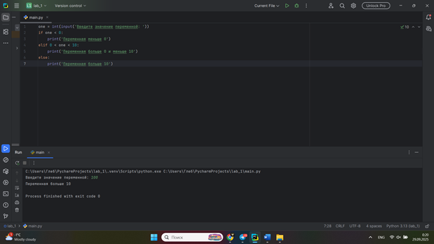
## Выводы

•	Ввод данных - пользователь вводит целое число, которое сохраняется в переменную one

if one < 0 - проверяет, является ли число отрицательным
•	elif 0 < one < 10 - проверяет, находится ли число в диапазоне от 0 до 10 (исключая границы)
•	else - все остальные случаи (число ≥ 10)


## Лабораторная работа №3
### Напишите программу, в которой будет проверяться есть ли переменная в указанном массиве используя логический оператор in. Самостоятельно посмотрите, как работает программа со значениями которых нет в массиве numbers.
```python
numbers = [1, 3, 4, 6, 8, 9]
value = int(input('Введите значение переменной: '))
if value in numbers:
    print('Переменная есть в данном массиве')
else:
    print('Переменной нет в этом массиве')

```
### Результат.
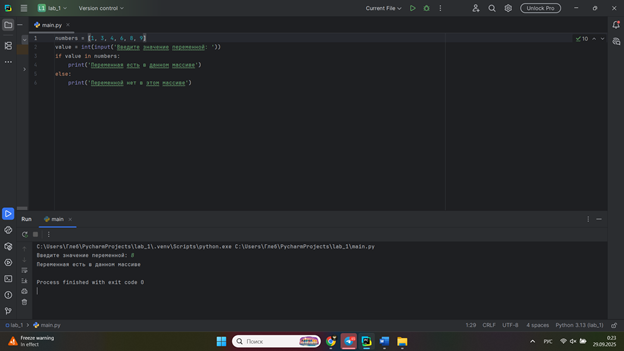
## Выводы

Данная программа проверяет наличие введенного пользователем числа в предопределенном массиве.
1.	Инициализация массива - создается список numbers = [1, 3, 4, 6, 8, 9]
2.	Ввод данных - пользователь вводит целое число, которое сохраняется в переменную value
3.	Проверка наличия - с помощью оператора in проверяется, содержится ли value в массиве numbers


## Лабораторная работа №4
### Напишите программу, которая будет определять находится ли  переменная в указанном массиве и если да, то проверьте четная она или  нет. Самостоятельно протестируйте данную программу с разными  значениями переменной value.
```python
numbers = [1, 3, 4, 6, 8, 9, 15, 16, 73, 321, 322]
value = int(input('Введите значение переменной: '))
if value in numbers:
    if value % 2 == 0:
        print('Переменная четная и есть в массиве numbers')
    else:
        print('Переменная нечетная и есть в массиве numbers')
else:
    print(f"Переменной нет в массиве numbers и она равна {value}")

```
### Результат.
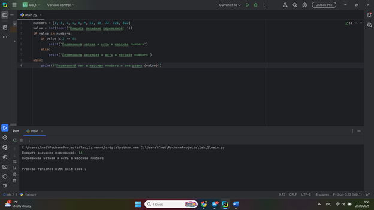
## Выводы

Данная программа выполняет двойную проверку введенного числа: сначала на наличие в массиве, затем на четность.
1.	Инициализация массива - создается список чисел numbers = [1, 3, 4, 6, 8, 9, 15, 16, 73, 321, 322]
2.	Ввод данных - пользователь вводит целое число в переменную value
3.	Первая проверка - оператором in определяется наличие числа в массиве
4.	Вторая проверка (если число найдено):
o	value % 2 == 0 - проверка на четность
o	Вывод соответствующего сообщения о четности и наличии в массиве
5.	Обработка отсутствия - если числа нет в массиве, выводится сообщение с его значением


## Лабораторная работа №5
### Напишите программу, в которой циклом for значения переменной i будут меняться от 0 до 10 и посмотрите, как разные виды сравнений и операций работают в цикле.
```python
for i in range(10):
    print('i = ', i)
    if i == 0:
     i += 2
    if i == 1:
        continue
    if i == 2 or i == 3:
        print('Переменная равна 2 или 3')
    elif i in [4, 5, 6]:
        print('Переменная равна 4,5 или 6')
    else:
        break
```
### Результат.
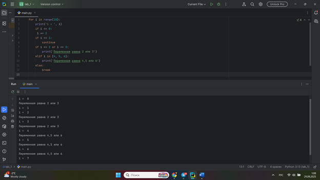
## Выводы

Данная программа демонстрирует работу цикла for с различными условиями и операторами управления потоком.
Логика работы:
1.	Цикл - выполняется для i от 0 до 9 (range(10))
2.	Базовый вывод - на каждой итерации выводится текущее значение i
3.	Последовательные проверки:
o	Если i == 0: значение увеличивается на 2 (но это не влияет на следующую итерацию)
o	Если i == 1: выполняется continue - переход к следующей итерации
o	Если i == 2 or i == 3: вывод сообщения
o	Если i в списке [4, 5, 6]: вывод другого сообщения
o	Во всех остальных случаях: выполняется break - выход из цикла


## Лабораторная работа №6
### Напишите программу, в которой при помощи цикла for определяется есть ли переменная value в строке string и посмотрите, как работает оператор else для циклов. Самостоятельно посмотрите, что выведет программа, если значение переменной value оказалось в строке string. Определять индекс буквы не обязательно, но если вы хотите, то это делается при помощи строки: index = string.find(value) Вы берете название переменной, в которой вы хотите что-то найти, затем применяете встроенный метод find() и в нем указываете то, что вам нужно найти. Данная строка вернет индекс искомого объекта.
```python
string = 'Привет всем изучающим Python!'
value = input()
for i in string:
    if i == value:
        index = string.find(value)
        print(f"Буква '{value}-' есть в строке под {index}- индексом")
        break
else:
    print(f"Буквы '{value}' нет в указанной строке")
```
### Результат.
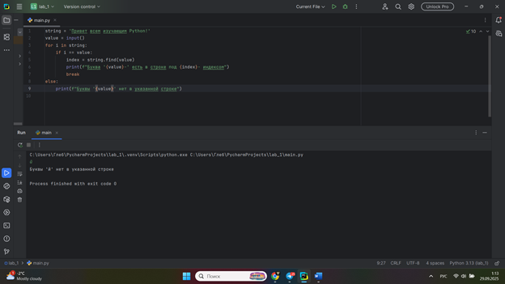
## Выводы

Данная программа ищет введенный символ в заданной строке и демонстрирует работу оператора else для циклов.
Логика работы:
1.	Инициализация - задается строка string = 'Привет всем изучающим Python!'
2.	Ввод данных - пользователь вводит символ для поиска в переменную value
3.	Поиск в цикле - перебираются все символы строки:
-	Если найден символ, равный value:
-	Определяется индекс через string.find(value)
-	Выводится сообщение о найденном символе и его индексе
-	Выполняется break - выход из цикла
4.	Блок else - выполняется только если цикл завершился естественным образом (без break)

## Лабораторная работа №7
### Напишите программу, в которой вы наглядно посмотрите, как работает цикл for проходя в обратном порядке, то есть, к примеру не от 0 до 10, а от 10 до 0. В уже готовой программе показано вычитание из 100, а вам во время реализации программы будет необходимо придумать свой вариант применения обратного цикла.
```python
value = 100
for i in range(10, -1, -1):
    value -= i
    print(i, value)
```
### Результат.
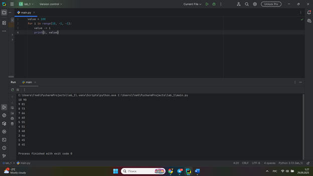
## Выводы

Данная программа демонстрирует работу цикла for в обратном порядке с последовательным вычитанием.
Логика работы:
1.	Инициализация - переменная value получает начальное значение 100
2.	Обратный цикл - range(10, -1, -1) генерирует числа от 10 до 0 включительно:
-	Старт: 10
-	Стоп: -1 (не включается)
-	Шаг: -1
3.	Операции в цикле:
-	На каждой итерации из value вычитается текущее значение i
-	Выводится текущее значение i и результат вычитания value


## Лабораторная работа №8
### Напишите программу используя цикл while, внутри которого есть какие-либо проверки, но быть осторожным, поскольку циклы while неправильно написанных условиях могут становится бесконечными, как указано в примере далее.
```python
value = 0
while value < 100:
    if value == 0:
        value += 10
    elif value // 5 > 1:
        value *= 5
    else:
        value -= 5
    print(value)
```
### Результат.
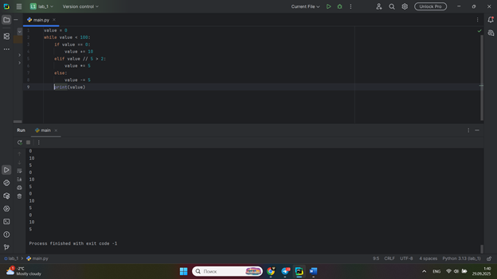
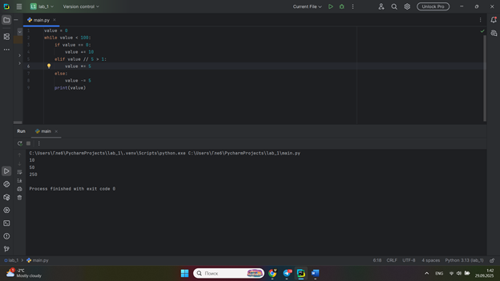
## Выводы

Данная программа демонстрирует работу цикла while с различными условиями изменения переменной.
Логика работы:
1.	Инициализация - переменная value начинает с 0
2.	Цикл while - выполняется пока value < 100
3.	Условия внутри цикла:
-	Если value == 0: увеличивает значение на 10
-	Если value // 5 > 1 (целочисленное деление): умножает значение на 5
-	Во всех остальных случаях: уменьшает значение на 5


## Лабораторная работа №9
### Напишите программу с использованием вложенных циклов и одной проверкой внутри них. Самое главное, не забудьте, что нельзя использовать одинаковые имена итерируемых переменных, когда вы используете вложенные циклы.
```python
value = 0
for i in range(10):
    for j in range(10):
        if i != j:
            value += j
        else:
            pass
print(value)
```
### Результат.
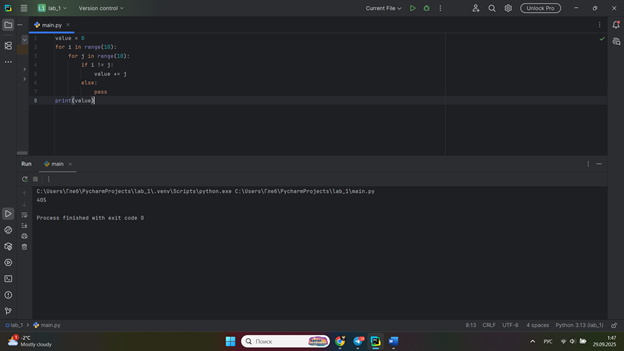
## Выводы

Данная программа демонстрирует работу вложенных циклов с условием и накоплением суммы.
Логика работы:
1.	Внешний цикл - перебирает значения i от 0 до 9
2.	Внутренний цикл - для каждого i перебирает значения j от 0 до 9
3.	Условие - если i != j, то значение j добавляется к переменной value
4.	Исключение - при i == j выполняется pass (ничего не происходит)

## Лабораторная работа №10
### Напишите программу с использованием flag, которое будет определять есть ли нечетное число в массиве. В данной задаче flag выступает в роли индикатора встречи нечетного числа в исходном массиве, четных чисел.
```python
even_array = [2, 4, 6, 8, 9]
flag = False
for value in even_array: 
 if value % 2 == 1:
    flag = True
if flag is True:
    print('В массиве есть нечетное число')
else:
    print('В массиве все числа четные').
```
### Результат.
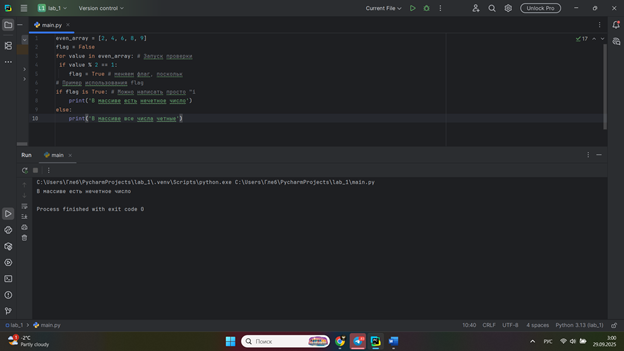
## Выводы
1.	Инициализация - создается массив even_array и флаг flag = False
2.	Проверка в цикле - перебираются все элементы массива:
-	Если встречается нечетное число (value % 2 == 1), флаг устанавливается в True
3.	Анализ результата:
-	Если flag is True - выводится сообщение о наличии нечетного числа
-	Если flag is False - выводится сообщение, что все числа четные

## Самостоятельная работа №1
### Напишите программу, которая преобразует 1 в 31. Для выполнения поставленной задачи необходимо обязательно и только один раз использовать: • Цикл for • *= 5 • += 1 Никаких других действий или циклов использовать нельзя.
```python
x = 1
for _ in range(2):
    x *= 5
    x += 1
print(x)
```
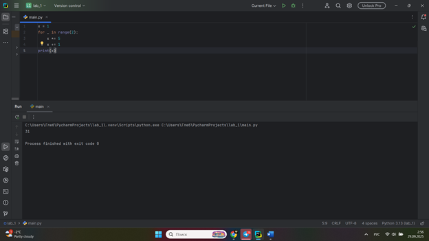
## Выводы

Программа преобразует число 1 в 31 за 2 итерации цикла, используя только разрешенные операции, и выводит результат.
  
## Самостоятельная работа №2
### Напишите программу, которая фразу «Hello World» выводит в обратном порядке, и каждая буква находится в одной строке консоли. Пример вывода в консоль. При этом необходимо обязательно использовать любой цикл, а также программа должна занимать не более 3 строк в редакторе кода.

```python
text = "Hello World"
for char in reversed(text):
    print(char)
```
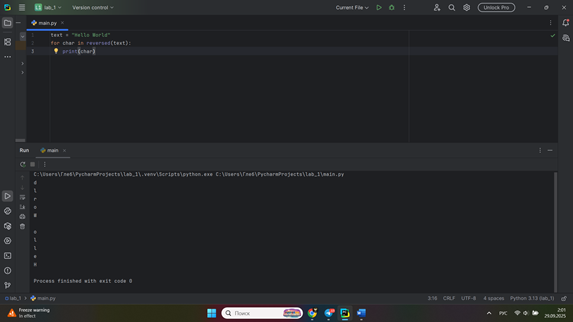
## Выводы
1.	Инициализация - создается строковая переменная text = "Hello World"
2.	Обратный цикл - функция reversed(text) возвращает итератор для перебора строки в обратном порядке
3.	Вывод символов - на каждой итерации цикла выводится один символ через print(char)

## Самостоятельная работа №3
### Напишите программу, на вход которой поступает значение из консоли, оно должно быть числовым и в диапазоне от 0 до 10 включительно (это необходимо учесть в программе). Если вводимое число не подходит по требованиям, то необходимо вывести оповещение об этом в консоль и остановить программу. Код должен вычислять в каком диапазоне находится полученное число. Нужно учитывать три диапазона: • от 0 до 3 включительно • от 3 до 6 • от 6 до 10 включительно Результатом работы программы будет выведенный в консоль диапазон. Программа должна занимать не более 10 строчек в редакторе кода.
```python
num = int(input())
if not 0 <= num <= 10:
    print("Число не в диапазоне 0-10")
else:
    if num <= 3:
        print("от 0 до 3 включительно")
    elif num <= 6:
        print("от 3 до 6")
    else:
        print("от 6 до 10 включительно")
```
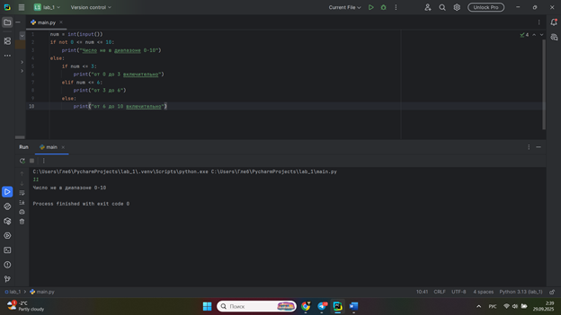
## Выводы

•	Программа получает число из консоли и проверяет его принадлежность диапазону 0-10
•	Если число не подходит - выводится сообщение об ошибке
•	Если число подходит - определяется его диапазон и выводится результат
•	Используются вложенные условия для компактности кода
  
## Самостоятельная работа №4
### Манипулирование строками. Напишите программу на Python, которая  принимает предложение (на английском) в качестве входных данных  от пользователя. Выполните следующие операции и отобразите  результаты:  • Выведите длину предложения.  • Переведите предложение в нижний регистр.  • Подсчитайте количество гласных (a, e, i, o, u) в предложении.  • Замените все слова "ugly" на "beauty".  • Проверьте, начинается ли предложение с "The" и заканчивается  ли на "end".  Проверьте работу программы минимум на 3 предложениях, чтобы  охватить проверку всех поставленных условий.
```python
sentence = input("Enter a sentence: ")

print("Length:", len(sentence))
print("Lowercase:", sentence.lower())

vowels = 'aeiou'
vowel_count = sum(1 for char in sentence.lower() if char in vowels)
print("Vowel count:", vowel_count)

new_sentence = sentence.replace("ugly", "beauty")
print("After replacement:", new_sentence)

print("Starts with 'The':", sentence.startswith("The"))
print("Ends with 'end':", sentence.endswith("end"))
```
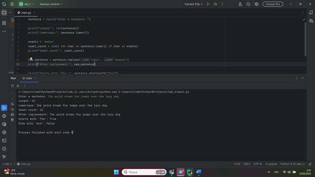


## Выводы

Программа выполняет анализ введенного английского предложения с помощью строковых операций:
•	Длина - подсчет общего количества символов
•	Регистр - преобразование к нижнему регистру
•	Гласные - подсчет букв a, e, i, o, u
•	Замена - изменение слова "ugly" на "beauty"
•	Проверка - начинается ли с "The" и заканчивается ли на "end"
  
## Самостоятельная работа №5
### Составьте программу, результатом которой будет данный вывод в консоль.
```python
string = 'hello'
string = 'hello'
memory = 'world'
counter = 0
values = [0, 2, 4, 6, 8, 10]
while counter != 10:
    if counter in values:
        print(string + ' ' + memory)
    else:
        print(string)
    counter += 1
print(string + ' world')
```
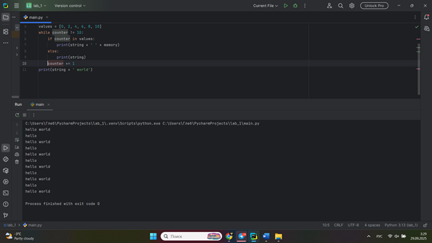
## Выводы

Программа выводит попеременно "hello world" и "hello" в течение 10 итераций. Когда счетчик находится в списке четных значений [0,2,4,6,8], печатается "hello world", в остальных случаях - только "hello". Результат - чередующаяся последовательность из 10 строк.
  


## Общие выводы по теме
В данной лабораторной работе я закрепил навыки программирования на Python, включая работу с циклами, условными операторами и переменными. Научился анализировать и корректировать готовый код для достижения требуемого результата, а также освоил принципы логического построения программных алгоритмов для генерации определенных последовательностей вывода. Практика показала важность точного следования условиям задачи и тщательной проверки работы программы на соответствие ожидаемому результату.
