# Тема 5. Базовые коллекции: Строки и списки.
Отчет по Теме #5 выполнил(а):
- Папета Глеб Павлович
- АИС-23-1

| Задание | Лаб_раб | Сам_раб |
| ------ | ------ | ------ |
| Задание 1 | + | + |
| Задание 2 | + | + |
| Задание 3 | + | + |
| Задание 4 | + | + |
| Задание 5 | + | + |
| Задание 6 | + |
| Задание 7 | + |
| Задание 8 | + |
| Задание 9 | + |
| Задание 10 | + |

знак "+" - задание выполнено; знак "-" - задание не выполнено;


## Лабораторная работа №1
### Друзья предложили вам поиграть в игру “найди отличия и убери повторения (версия для программистов)”. Суть игры состоит в том, что на вход программы поступает два множества, а ваша задача вывести все элементы первого, которых нет во втором. А вы как раз недавно прошли множества и знаете их возможности, поэтому это не составит для вас труда. P.S. Посмотрите что происходит с повторяющимися значениями в множествах, это достаточно интересно

```python
set_1 ={'White', 'Black', 'Red', 'Pink'}
set_2 = {'Red', 'Green', 'Blue', 'Red'}
print('1', set_1 - set_2)

set_1 ={'White', 'Black', 'Red', 'Pink', 'Black', 'White'}
set_2 = {'Red', 'Green', 'Blue', 'Red'}
print('2', set_1 - set_2)

set_1 ={'White', 'Black', 'Red', 'Pink', 'Red', 'Red'}
set_2 = {'Red', 'Green', 'Red', 'Red', 'Red'}
print('3', set_1 - set_2)
```
### Результат.
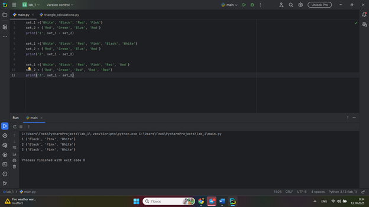

## Выводы

Операция вычитания множеств (-) эффективно находит разницу элементов. Множества автоматически удаляют дубликаты, что делает их идеальными для задач поиска уникальных элементов.

## Лабораторная работа №2
### Напишите две одинаковые программы, только одна будет использовать set(), а вторая frozenset() и попробуйте к исходному множеству добавить несколько элементов, например, через цикл
```python
a = set('abcdefg')
print(a)
for i in range(1, 5):
    a.add(i)
print(a)
```
```python
a = frozenset('abcdefg')
print(a)
for i in range(1, 5):
    a.add(i)
print(a)
```

### Результат.
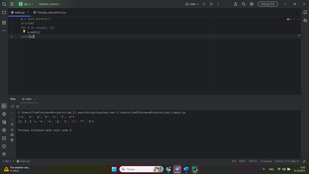
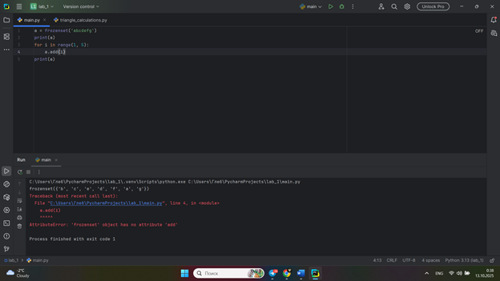
## Выводы

Тип данных set является изменяемым (mutable) и поддерживает добавление элементов. frozenset — неизменяемый (immutable) тип, и попытка добавления элементов вызывает ошибку, что полезно для создания константных коллекций.

## Лабораторная работа №3
### На вход в программу поступает список (минимальной длиной 2 символа). Напишите программу, которая будет менять первый и последний элемент списка. P.S. В Python есть прикольное свойство, благодаря которому эту задачу можно решить более красиво, использовав всего 2 сточки кода, если интересно можете самостоятельно найти это решение.
```python
def replace(input_list):
    memory = input_list[0]
    input_list[0] = input_list[-1]
    input_list[-1] = memory

    return input_list
print(replace([1, 2, 3, 4, 5]))
```
### Результат.
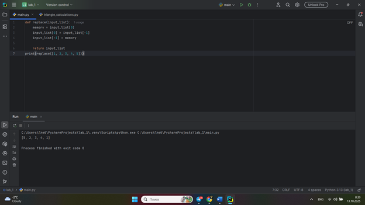
## Выводы

Обмен значений первого и последнего элемента списка можно реализовать через временную переменную. В Python это также можно сделать более элегантно через кортежи: input_list[0], input_list[-1] = input_list[-1], input_list[0]

## Лабораторная работа №4
### На вход в программу поступает список (минимальной длиной 10 символов). Напишите программу, которая выводит элементы с индексами от 2 до 6. В программе необходимо использовать “срез”
```python
a = [15, 22, 36, 47, 58, 69, 112, 135, 158, 146, 168, 169, 211]
print(a[2:6])
```
### Результат.
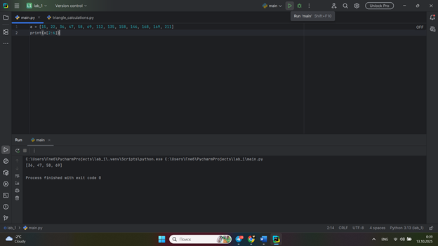
## Выводы

Срезы (slicing) в Python — мощный и лаконичный инструмент для получения подмножества элементов из списка по их индексам. Синтаксис [start:stop] позволяет легко извлекать диапазоны данных.

## Лабораторная работа №5
### Иван задумался о поиске «бесполезного» числа, полученного из списка. Суть поиска в следующем: он берет произвольный список чисел, находит самое большое из них, а затем делит его на длину списка. Студент пока не придумал, где может пригодиться подобное значение, но ищет у вас помощи в реализации такой функции useless()
```python
def useless(lst):
    return max(lst) / len(lst)

print(useless([4, 7, 9, 20]))
print(useless([-13.5, 11, 15, 17.5, 48]))
print(useless([44, 56, 78, 89, 12, 45, 67, 32, 69]))
```
### Результат.
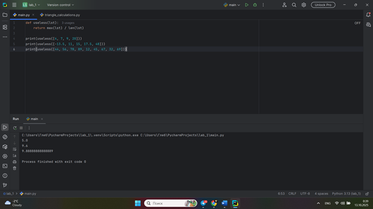
## Выводы

Функция useless() демонстрирует комбинирование встроенных функций max() и len() для вычисления абстрактной метрики. Это показывает гибкость Python в создании простых, но мощных функций за несколько строк.

## Лабораторная работа №6
### Ребята не могут определится каким супергероем они хотят стать. У них есть случайно составленный список супергероев, и вы должны определить кто из ребят будет каким супергероем. Необходимо использовать разделение списков.
```python
superheroes = ['ironman', 'superman', 'antman']

vasya, vlad, valera = superheroes
print("Вася -", vasya)
print( "Валера -", valera)
print( "Влад - ", vlad)

```
### Результат.
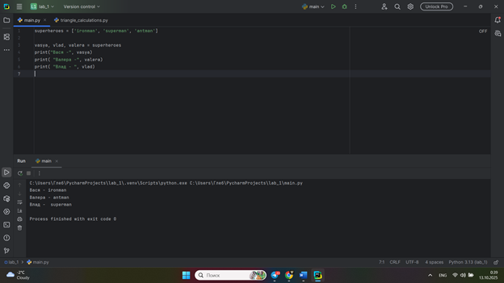
## Выводы

Распаковка списка (list unpacking) — удобный механизм для присвоения элементов списка отдельным переменным за одну операцию. Это делает код чище и читабельнее.

## Лабораторная работа №7
### Вовочка, насмотревшись передачи “Слабое звено” решил написать программу, которая также будет находить самое слабое звено (минимальный элемент) и удалять его, только делать он это хочет не с людьми, а со списком. Помогите Вовочке с реализацией программы. Подсказка: для этого вам необходимо отсортировать список и удалить значение при помощи pop().
```python
a = [-92, -58, 69, -2, 55, 42, 31, - 15, 67, -34, 169]
a.sort()
print('Отсортированный список:\n', a)
a.pop(0)
print('Без наименьшего элемента:\n', a)
```
### Результат.
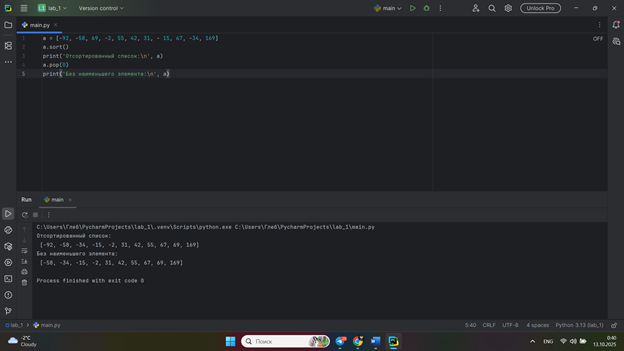
## Выводы

Комбинация методов sort() и pop(0) позволяет эффективно найти и удалить минимальный элемент списка. Важно помнить, что sort() изменяет исходный список, а pop() удаляет элемент по индексу.

## Лабораторная работа №8
### Михаил решил создать большой n-мерный список, для этого он случайным образом создал несколько списков, состоящих минимум из 3, а максимум из 10 элементов и поместил их в один большой список. Он также как и Иван не знает зачем ему это сейчас нужно, но надеется на то, что это пригодится ему в будущем.
```python
from random import randint
def list_maker():
    a = [randint(1, 100)] * randint(3, 10)
    return a
if __name__ == '__main__':
    result = []
    for i in range(randint(1, 5)):
        result.append(list_maker())
        print(result)
```
### Результат.
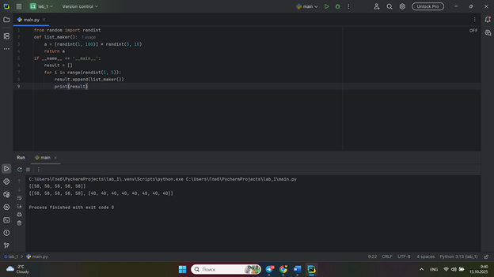
## Выводы

С помощью генерации случайных данных и вложенных списков можно легко создавать сложные n-мерные структуры. Это основа для моделирования многомерных данных, используемых в более сложных приложениях.

## Лабораторная работа №9
### Вы работаете в ресторане и отвечает за статистику покупок, ваша задача сравнить между собой заказы покупателей, которые указаны в разном порядке. Реализуйте функцию superset(), которая принимает 2 множества. Результат работы функции: вывод в консоль одного из сообщений в зависимости от ситуации: 1 - «Супермножество не обнаружено» 2 – «Объект {X} является чистым супермножеством» 3 – «Множества равны»
```python
def superset(set_1, set_2):
    if set_1 > set_2:
        print(f'Объект {set_1} является чистым супермножеством')
    elif set_1 == set_2:
        print(f'Множества равны')
    elif set_1 < set_2:
        print(f'Объект {set_2} является чистым супермножеством')
    else:
        print(f'Супермножество не обнаружено')

if __name__ == '__main__':
    superset({1, 2, 5, 7}, {6, 9})
    superset({1, 2, 5, 7}, {5, 3, 8 ,2})
    superset({3, 5}, {5, 3, 8, 1})
    superset({69, 100}, {1, 2})
```
### Результат.
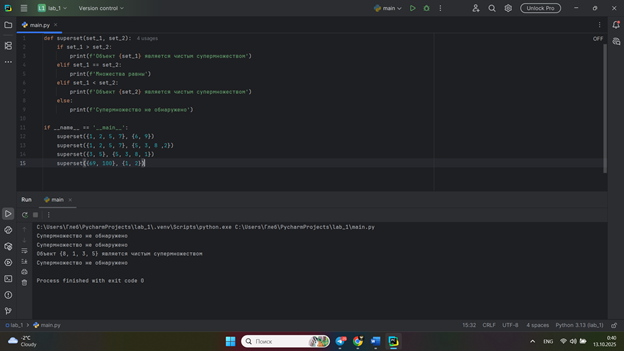
## Выводы

Сравнение множеств через операторы >, <, == позволяет легко проверять отношения включения (супермножество/подмножество) между наборами данных, что полезно для анализа пересечений.

## Лабораторная работа №10
### Предположим, что вам нужно разобрать стопку бумаг, но нужно начать работу с нижней, “переверните стопку”. Вам дан произвольный список. Представьте его в обратном порядке. Программа должна занимать не более двух строк в редакторе кода
```python
mylist = [4, 6, 8, 9, 11]
print(mylist[::-1])
```
### Результат.
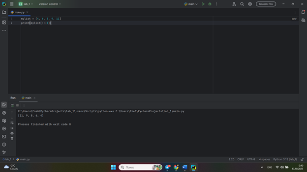
## Выводы

Использование среза с отрицательным шагом ([::-1]) — это самый питоновский (pythonic) и эффективный способ реверсирования списка. Он демонстрирует мощь и лаконичность синтаксиса срезов.

## Самостоятельная работа №1
### Ресторан на предприятии ведет учет посещений за неделю при помощи кода работника. У них есть список со всеми посещениями за неделю. Ваша задача почитать: • Сколько было выдано чеков • Сколько разных людей посетило ресторан • Какой работник посетил ресторан больше всех раз Список выданных чеков за неделю: [8734, 2345, 8201, 6621, 9999, 1234, 5678, 8201, 8888, 4321, 3365, 1478, 9865, 5555, 7777, 9998, 1111, 2222, 3333, 4444, 5556, 6666, 5410, 7778, 8889, 4445, 1439, 9604, 8201, 3365, 7502, 3016, 4928, 5837, 8201, 2643, 5017, 9682, 8530, 3250, 7193, 9051, 4506, 1987, 3365, 5410, 7168, 7777, 9865, 5678, 8201, 4445, 3016, 4506, 4506] Результатом выполнения задачи будет: листинг кода, и вывод в консоль, в котором будет указана вся необходимая информация.
```python
checks = [8734, 2345, 8201, 6621, 9999, 1234, 5678, 8201, 8888, 4321,
          3365, 1478, 9865, 5555, 7777, 9998, 1111, 2222, 3333, 4444,
          5556, 6666, 5410, 7778, 8889, 4445, 1439, 9604, 8201, 3365,
          7502, 3016, 4928, 5837, 8201, 2643, 5017, 9682, 8530, 3250,
          7193, 9051, 4506, 1987, 3365, 5410, 7168, 7777, 9865, 5678,
          8201, 4445, 3016, 4506, 4506]

total_checks = len(checks)

unique_visitors = len(set(checks))

from collections import Counter

visitor_counts = Counter(checks)
most_frequent_visitor, max_visits = visitor_counts.most_common(1)[0]

print("=== АНАЛИТИКА ПОСЕЩЕНИЙ РЕСТОРАНА ЗА НЕДЕЛЮ ===")
print(f"Всего было выдано чеков: {total_checks}")
print(f"Разных людей посетило ресторан: {unique_visitors}")
print(f"Работник с кодом {most_frequent_visitor} посетил ресторан чаще всех - {max_visits} раз(а)")
print("\nТоп-5 самых частых посетителей:")
for visitor, count in visitor_counts.most_common(5):
    print(f"  Код {visitor}: {count} посещений")

```
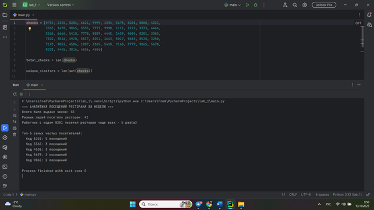
## Выводы

Множества эффективно удаляют дубликаты для подсчета уникальных посетителей. Counter из collections упрощает подсчет частоты элементов, что позволяет быстро анализировать данные.

## Самостоятельная работа №2
### На физкультуре студенты сдавали бег, у преподавателя физкультуры есть список всех результатов, ему нужно узнать • Три лучшие результата • Три худшие результата • Все результаты начиная с 10 Ваша задача помочь ему в этом. Список результатов бега: [10.2, 14.8, 19.3, 22.7, 12.5, 33.1, 38.9, 21.6, 26.4, 17.1, 30.2, 35.7, 16.9, 27.8, 24.5, 16.3, 18.7, 31.9, 12.9, 37.4] Результатом выполнения задачи будет: листинг кода, и вывод в консоль, в котором будет указана вся необходимая информация.
```python
results = [10.2, 14.8, 19.3, 22.7, 12.5, 33.1, 38.9, 21.6, 26.4, 17.1,
           30.2, 35.7, 16.9, 27.8, 24.5, 16.3, 18.7, 31.9, 12.9, 37.4]

sorted_results = sorted(results)

print("=== АНАЛИЗ РЕЗУЛЬТАТОВ БЕГА ===")
print(f"Все результаты: {results}")
print(f"Отсортированные результаты: {sorted_results}")
print()

print("Три лучшие результата:")
for i, result in enumerate(sorted_results[:3], 1):
    print(f"  {i} место: {result} сек")

print()

print("Три худшие результата:")
for i, result in enumerate(sorted_results[-3:][::-1], 1):
    print(f"  {i} место с конца: {result} сек")

print()

print("Все результаты начиная с 10-го места:")
for i, result in enumerate(sorted_results[9:], 10):
    print(f"  {i} место: {result} сек")

print()
print("=== СВОДНАЯ ИНФОРМАЦИЯ ===")
print(f"Общее количество результатов: {len(results)}")
print(f"Лучший результат: {min(results)} сек")
print(f"Худший результат: {max(results)} сек")
print(f"Средний результат: {sum(results)/len(results):.1f} сек")
```
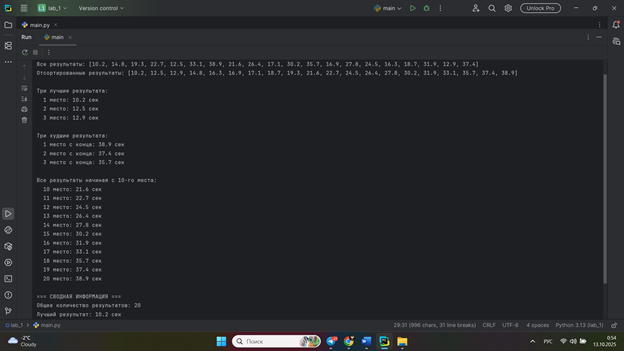
## Выводы

Сортировка списка позволяет легко определить лучшие/худшие результаты. Срезы Python обеспечивают простой доступ к диапазонам данных, а комбинация min/max/sum дает полную статистическую картину.

## Самостоятельная работа №3
### Преподаватель по математике придумал странную задачку. У вас есть три списка с элементами, каждый элемент которых – длина стороны треугольника, ваша задача найти площади двух треугольников, составленные из максимальных и минимальных элементов полученных списков. Результатом выполнения задачи будет: листинг кода, и вывод в консоль, в котором будут указаны два этих значения. Три списка: one = [12, 25, 3, 48, 71] two = [5, 18, 40, 62, 98] three = [4, 21, 37, 56, 84]
```python
import math

one = [12, 25, 3, 48, 71]
two = [5, 18, 40, 62, 98]
three = [4, 21, 37, 56, 84]

print("Исходные списки:")
print(f"one = {one}")
print(f"two = {two}")
print(f"three = {three}")
print()

def calculate_triangle_area(a, b, c):
    if a + b > c and a + c > b and b + c > a:
        p = (a + b + c) / 2
        area = math.sqrt(p * (p - a) * (p - b) * (p - c))
        return area
    else:
        return None

min_one = min(one)
min_two = min(two)
min_three = min(three)

max_one = max(one)
max_two = max(two)
max_three = max(three)

print("Минимальные элементы:")
print(f"min_one = {min_one}, min_two = {min_two}, min_three = {min_three}")
print("Максимальные элементы:")
print(f"max_one = {max_one}, max_two = {max_two}, max_three = {max_three}")
print()

triangle_min = [min_one, min_two, min_three]
triangle_max = [max_one, max_two, max_three]

print("Треугольник из минимальных элементов:", triangle_min)
print("Треугольник из максимальных элементов:", triangle_max)
print()

area_min = calculate_triangle_area(min_one, min_two, min_three)
area_max = calculate_triangle_area(max_one, max_two, max_three)

print("=== РЕЗУЛЬТАТЫ ===")
if area_min is not None:
    print(f"Площадь треугольника из минимальных элементов: {area_min:.2f}")
else:
    print("Треугольник из минимальных элементов не существует!")

if area_max is not None:
    print(f"Площадь треугольника из максимальных элементов: {area_max:.2f}")
else:
    print("Треугольник из максимальных элементов не существует!")

print("\n=== ПРОВЕРКА УСЛОВИЙ СУЩЕСТВОВАНИЯ ТРЕУГОЛЬНИКОВ ===")
print(f"Треугольник мин: {min_one} + {min_two} = {min_one + min_two} > {min_three} -> {min_one + min_two > min_three}")
print(f"Треугольник макс: {max_one} + {max_two} = {max_one + max_two} > {max_three} -> {max_one + max_two > max_three}")
```
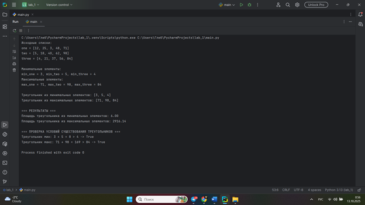
## Выводы

Обязательна проверка условий существования треугольника перед вычислениями. Формула Герона универсальна для расчета площади по трем сторонам, но не все комбинации длин отрезков могут образовывать треугольник.

## Самостоятельная работа №4
### Никто не любит получать плохие оценки, поэтому Борис решил это исправить. Допустим, что все оценки студента за семестр хранятся в одном списке. Ваша задача удалить из этого списка все двойки, а все тройки заменить на четверки. Списки оценок (проверить работу программы на всех трех вариантах): [2, 3, 4, 5, 3, 4, 5, 2, 2, 5, 3, 4, 3, 5, 4] [4, 2, 3, 5, 3, 5, 4, 2, 2, 5, 4, 3, 5, 3, 4] [5, 4, 3, 3, 4, 3, 3, 5, 5, 3, 3, 3, 3, 4, 4] Результатом выполнения задачи будет: листинг кода, и вывод в консоль, в котором будут три обновленных массива
```python
def fix_grades(grades):

    fixed_grades = []
    for grade in grades:
        if grade == 3:
            fixed_grades.append(4)
        elif grade != 2:
            fixed_grades.append(grade)

    return fixed_grades


grades_list_1 = [2, 3, 4, 5, 3, 4, 5, 2, 2, 5, 3, 4, 3, 5, 4]
grades_list_2 = [4, 2, 3, 5, 3, 5, 4, 2, 2, 5, 4, 3, 5, 3, 4]
grades_list_3 = [5, 4, 3, 3, 4, 3, 3, 5, 5, 3, 3, 3, 3, 4, 4]

print("=== ОБРАБОТКА ОЦЕНОК СТУДЕНТА ===")
print("Правила:")
print("- Все двойки удаляются")
print("- Все тройки заменяются на четверки")
print()

print("Список 1:")
print(f"Исходный: {grades_list_1}")
fixed_1 = fix_grades(grades_list_1)
print(f"Исправленный: {fixed_1}")
print(f"Статистика: удалено {len(grades_list_1) - len(fixed_1)} двоек, "
      f"заменено {grades_list_1.count(3)} троек")
print()

print("Список 2:")
print(f"Исходный: {grades_list_2}")
fixed_2 = fix_grades(grades_list_2)
print(f"Исправленный: {fixed_2}")
print(f"Статистика: удалено {len(grades_list_2) - len(fixed_2)} двоек, "
      f"заменено {grades_list_2.count(3)} троек")
print()

print("Список 3:")
print(f"Исходный: {grades_list_3}")
fixed_3 = fix_grades(grades_list_3)
print(f"Исправленный: {fixed_3}")
print(f"Статистика: удалено {len(grades_list_3) - len(fixed_3)} двоек, "
      f"заменено {grades_list_3.count(3)} троек")
print()

print("=== СВОДНАЯ СТАТИСТИКА ===")
all_original = grades_list_1 + grades_list_2 + grades_list_3
all_fixed = fixed_1 + fixed_2 + fixed_3

print(f"Всего оценок в исходных списках: {len(all_original)}")
print(f"Всего оценок после обработки: {len(all_fixed)}")
print(f"Удалено двоек всего: {all_original.count(2)}")
print(f"Заменено троек всего: {all_original.count(3)}")
print(f"Средний балл до обработки: {sum(all_original) / len(all_original):.2f}")
print(f"Средний балл после обработки: {sum(all_fixed) / len(all_fixed):.2f}")

```
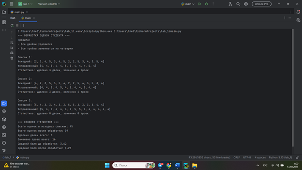
## Выводы

Фильтрация и преобразование элементов списка - частая практическая задача. Создание нового списка предпочтительнее модификации исходного, а анализ "до/после" демонстрирует эффективность преобразований.

## Самостоятельная работа №5
### Вам предоставлены списки натуральных чисел, из них необходимо сформировать множества. При этом следует соблюдать это правило: если какое-либо число повторяется, то преобразовать его в строку по следующему образцу: например, если число 4 повторяется 3 раза, то в множестве будет следующая запись: само число 4, строка «44», строка «444». Множества для теста: list_1 = [1, 1, 3, 3, 1] list_2 = [5, 5, 5, 5, 5, 5, 5] list_3 = [2, 2, 1, 2, 2, 5, 6, 7, 1, 3, 2, 2] Результаты вывода (порядок может отличаться, поскольку мы работаем с set()): {'11', 1, 3, '33', '111'} {5, '5555', '555555', '55555', '555', '55', '5555555'} {'11', 1, 3, 2, 5, 6, '222222', '222', 7, '2222', '22222', '22'}
```python
def create_special_set(numbers):
   
    result_set = set()

    from collections import Counter
    count_dict = Counter(numbers)

    for number, count in count_dict.items():
        result_set.add(number)

        if count > 1:
            for repeat_count in range(2, count + 1):
                repeated_str = str(number) * repeat_count
                result_set.add(repeated_str)

    return result_set


list_1 = [1, 1, 3, 3, 1]
list_2 = [5, 5, 5, 5, 5, 5, 5]
list_3 = [2, 2, 1, 2, 2, 5, 6, 7, 1, 3, 2, 2]

print("=== ФОРМИРОВАНИЕ МНОЖЕСТВ С ПРЕОБРАЗОВАНИЕМ ПОВТОРОВ ===")
print("Правило: если число повторяется n раз, то добавляем:")
print("  - само число")
print("  - строки: число×2, число×3, ..., число×n")
print()

print("list_1 =", list_1)
set_1 = create_special_set(list_1)
print("Множество 1:", set_1)
print()

print("list_2 =", list_2)
set_2 = create_special_set(list_2)
print("Множество 2:", set_2)
print()

print("list_3 =", list_3)
set_3 = create_special_set(list_3)
print("Множество 3:", set_3)
print()

print("=== ПОДРОБНЫЙ АНАЛИЗ ПРЕОБРАЗОВАНИЙ ===")


def detailed_analysis(numbers, set_name):
    from collections import Counter
    count_dict = Counter(numbers)
    print(f"\n{set_name}:")
    for number, count in count_dict.items():
        if count == 1:
            print(f"  Число {number}: встречается 1 раз -> добавляем только {number}")
        else:
            additions = [number] + [str(number) * i for i in range(2, count + 1)]
            print(f"  Число {number}: встречается {count} раз -> добавляем {additions}")


detailed_analysis(list_1, "list_1")
detailed_analysis(list_2, "list_2")
detailed_analysis(list_3, "list_3")
```
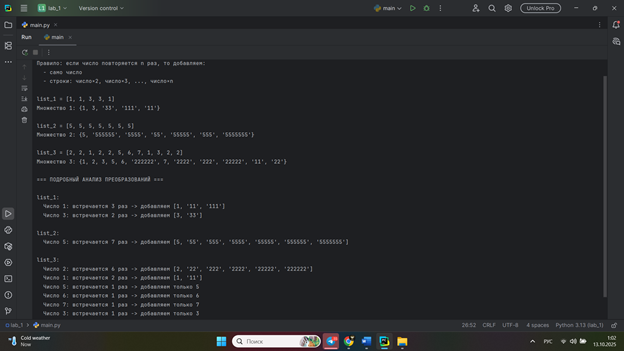
## Выводы

Множества могут содержать элементы разных типов (числа и строки). Counter автоматизирует подсчет вхождений элементов, а преобразование данных по заданным правилам расширяет возможности множеств.

## Общие выводы по теме
Изученные структуры данных - списки, множества и кортежи - представляют собой мощный инструментарий для решения разнообразных задач обработки информации. Каждая структура обладает уникальными характеристиками: списки обеспечивают гибкость изменений, множества эффективно работают с уникальными элементами, а кортежи гарантируют неизменяемость данных. Практическое применение операций сортировки, фильтрации и преобразования данных демонстрирует универсальность Python для аналитических задач. Особенно ценными оказались встроенные методы работы со срезами и возможности быстрого анализа статистических показателей. Освоенные техники позволяют оптимизировать код, делая его более читаемым и эффективным. В целом, комбинирование различных структур данных открывает широкие возможности для создания оптимальных алгоритмов обработки информации в профессиональной разработке.

