# Тема 7. Базовые коллекции: словари, кортежи
Отчёт по теме выполнил:
  - Папета Глеб Павлович
  - АИС-23-1

| Задание | Лаб_раб | Сам_раб |
| ------ | ------ | ------ |
| Задание 1 | + | + |
| Задание 2 | + | + | 
| Задание 3 | + | + | 
| Задание 4 | + | + |
| Задание 5 | + | + | 
| Задание 6 | + |  | 
| Задание 7 | + |  | 
| Задание 8 | + |  | 
| Задание 9 | + |  | 
| Задание 10 | + |  | 

знак "+" - задание выполнено; знак "-" - задание не выполнено;

## Лабораторные задания №7

## 1)Составьте текстовый файл и положите его в одну директорию с программой на Python. Текстовый файл должен состоять минимум из двух строк.

```python
I have travelled a lot,
I have seen the world,
But my favorite place
Is my home space.
```
### Результат
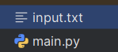
### Вывод: Создание текстового файла - успешно создан файл с многострочным текстом для последующих экспериментов с файловыми операциями
## 2) Напишите программу, которая выведет только первую строку из вашего файла, при этом используйте конструкцию open()/close().

```python
f = open('input.txt', 'r')
print(f.readline())
f.close()
```
### Результат
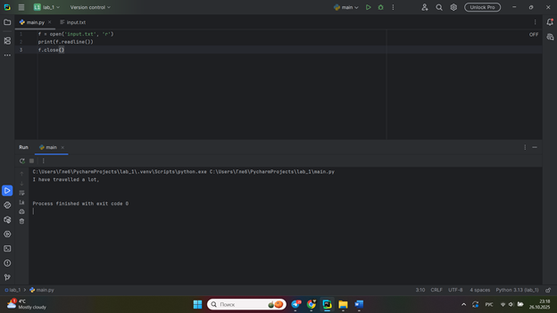

### Вывод: тение первой строки - освоен базовый синтаксис open()/close() и работа с методом readline() для поэтапного чтения файла
## 3) Напишите программу, которая выведет все строки из вашего файла в массиве, при этом используйте конструкцию open(/)/close().

```python
f = open('input.txt', 'r')
print(f.readlines())
f.close()
```
### Результат
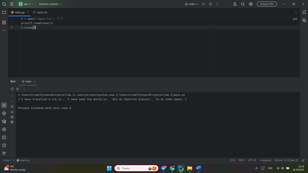

### Вывод: Чтение всех строк в массив - изучен метод readlines() для получения всего содержимого файла в виде списка строк


## 4) Напишите программу, которая выведет все строки из вашего файла в массиве, при этом используйте конструкцию with open().

```python
with open('input.txt') as f:
    print(f.readlines())
```
### Результат


### Вывод: Конструкция with open() - применена современная практика работы с файлами, обеспечивающая автоматическое закрытие и безопасность


## 5) Напишите программу, которая выведет каждую строку из вашего файла отдельно, при этом используйте конструкцию with open().

```python
with open('input.txt') as f:
    for line in f:
        print(line)
```
### Результат
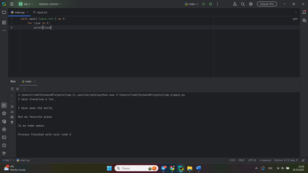
### Вывод: Построчное чтение - освоена итерация по файловому объекту для эффективной обработки больших файлов без загрузки в память


## 6) Напишите программу, которая будет добавлять новую строку в ваш файл, а потом выведет полученный файл в консоль. Вывод можно осуществлять любым способом. Обязательно проверьте сам файл, чтобы изменения в нем тоже отображались.

```python
with open('input.txt', 'a+') as f:
    f.write('\n Im like Hu Tao')

with open('input.txt', 'r') as f:
    result = f.readlines()
    print(result)
```
### Результат
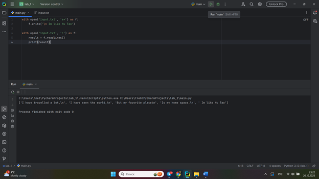

### Вывод: Добавление данных в файл - изучен режим 'a+' для дополнения существующего файла новой информацией


## 7) Напишите программу, которая перепишет всю информацию, которая была у вас в файле до этого, например, направит любые данные из произвольно вами составленного списка. Также не забудьте проверить что измененная вами информация сохранилась в файле.

```python
melon = ['One','two','three']
with open ('input.txt', 'w') as f:
    for line in melon:
        f.write('\nCycle run ' + line)
    print('Done!')
```
### Результат
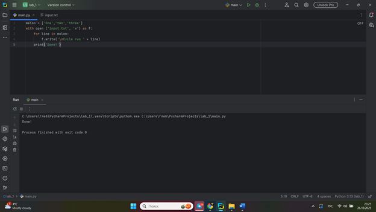

### Вывод: Перезапись файла - освоен режим 'w' для полной замены содержимого файла новыми данными


## 8) Выберите любую папку на своем компьютере, имеющую вложенные директории. Выведите на печать в терминал ее содержимое, как и всех подкаталогов при помощи функции print_docs(directory).

```python
import os

def print_docs(directory):
    all_files = os.walk(directory)
    for catalog in all_files:
        print(f'Папка {catalog[0]} Сожержит: ')
    print(f'Директории: {"," .join([folder for folder in catalog[1]])}')
    print(f'Файлы: {"," .join([file for file in catalog[2]])}')
    print('-' * 40)

print_docs('D:/мемы')
```
### Результат
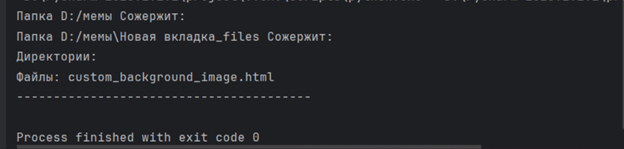

### Вывод: Работа с файловой системой - применена библиотека os для рекурсивного обхода директорий и анализа структуры папок

## 9) Документ «input.txt» содержит следующий текст:
Приветствие
Спасибо
Извините
Пожалуйста
До свидания
Ты готов?
Как дела?
С днем рождения!
Удача!
Я тебя люблю.

Требуется реализовать функцию, которая выводит слово, имеющее максимальную длину (или список слов, если таковых несколько). 

```python
def longest_words(file):
    with open(file, encoding='utf-8') as f:
        words = f.read().split()
        max_length = len(max(words, key=len))
        for word in words:
            if len(word) == max_length:
                sought_word = word

        if len(sought_word) == 1:
            return sought_word[0]
        return sought_word

print(longest_words('input.txt'))

```
### Результат
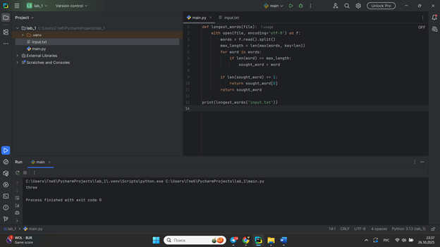

### Вывод: Анализ текста - создана функция для поиска самого длинного слова в тексте с обработкой различных сценариев

## 10) Требуется создать сsv-файл «rows_300.csv» со следующими столбцами:
. № – номер по порядку (от 1 до 300);
. Секунда – текущая секунда на вашем ПК;
. Микросекунда – текущая миллисекунда на часах.
Для наглядности на каждой интерации цикла искусственно приостанавливайте скрипт на 0,01 секунды.

```python
import csv
import datetime
import time

with open("rows_300.csv",'w', encoding='utf-8', newline='') as f:
    writer = csv.writer(f)
    writer.writerow(['№','Секунда', 'Микросекунда'])
    for line in range(1,301):
        writer.writerow([line, datetime.datetime.now().second, datetime.datetime.now().microsecond])
        time.sleep(0.01)
```
### Результат
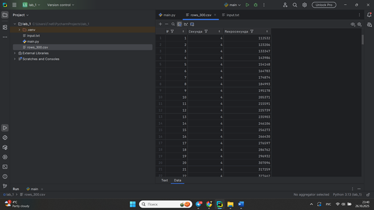

### Вывод: Генерация CSV-файла - освоена работа с модулем csv для создания структурированных данных и форматированного вывода


## Самостоятельные задания #7.

## 1) Найдите в интернете любую статью (объем статьи не менее 200 слов), скопируйте ее содержимое в файл и напишите программу, которая считает количество слов в текстом файле и определит самое часто встречающееся слово. Результатом выполнения задачи будет: скриншот файла со статьей, листинг кода, и вывод в консоль, в котором будет указана вся необходимая информация.

```python
from collections import Counter


def count_words_and_find_most_common(filename):
    try:
        with open(filename, 'r', encoding='utf-8') as file:
            text = file.read()

        punctuation = '.,!?;:"()—«»'
        for char in punctuation:
            text = text.replace(char, '')

        words = text.lower().split()
        word_count = len(words)

        word_freq = Counter(words)
        most_common_word, frequency = word_freq.most_common(1)[0]

        return word_count, most_common_word, frequency

    except FileNotFoundError:
        print(f"Ошибка: Файл {filename} не найден")
        return None, None, None
    except Exception as e:
        print(f"Ошибка: {e}")
        return None, None, None


def main():
    filename = "input.txt"

    word_count, most_common_word, frequency = count_words_and_find_most_common(filename)

    if word_count is not None:
        print(f"Количество слов в файле: {word_count}")
        print(f"Самое часто встречающееся слово: '{most_common_word}'")
        print(f"Количество повторений: {frequency}")


if __name__ == "__main__":
    main()
```
### Результат
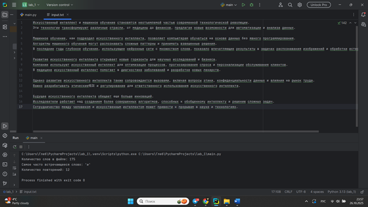
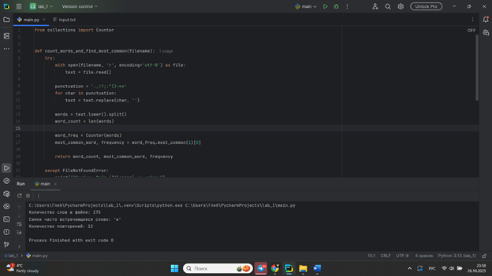

### Вывод: Статистика текста - реализован подсчет слов и анализ частотности с обработкой пунктуации и регистра символов

   
## 2) У вас появилась потребность в ведении книги расходов, посмотрев все существующие варианты вы пришли к выводу что вас ничего не устраивает и нужно все делать самому. Напишите программу для учета расходов. Программа должна позволять вводить информацию о расходах, сохранять ее в файл и выводить существующие данные в консоль. Ввод информации происходит через консоль. Результатом выполнения задачи будет: скриншот файла с учетом расходов, листинг кода, и вывод в консоль, с демонстрацией работоспособности программы.

```python
import json
import os
from datetime import datetime


class ExpenseTracker:
    def __init__(self, filename="expenses.json"):
        self.filename = filename
        self.expenses = []
        self.load_expenses()

    def load_expenses(self):
        """Загрузка расходов из файла"""
        if os.path.exists(self.filename):
            try:
                with open(self.filename, 'r', encoding='utf-8') as file:
                    self.expenses = json.load(file)
                print(f"Загружено {len(self.expenses)} записей о расходах")
            except Exception as e:
                print(f"Ошибка при загрузке файла: {e}")
                self.expenses = []
        else:
            print("Файл с расходами не найден. Будет создан новый.")

    def save_expenses(self):
        """Сохранение расходов в файл"""
        try:
            with open(self.filename, 'w', encoding='utf-8') as file:
                json.dump(self.expenses, file, ensure_ascii=False, indent=2)
            print(f"Данные сохранены в файл: {self.filename}")
        except Exception as e:
            print(f"Ошибка при сохранении: {e}")

    def add_expense(self):
        """Добавление нового расхода"""
        print("\n--- ДОБАВЛЕНИЕ НОВОГО РАСХОДА ---")

        try:
            amount = float(input("Введите сумму расхода: "))
            category = input("Введите категорию расхода: ").strip()
            description = input("Введите описание расхода: ").strip()

            expense = {
                'id': len(self.expenses) + 1,
                'date': datetime.now().strftime("%Y-%m-%d %H:%M:%S"),
                'amount': amount,
                'category': category,
                'description': description
            }

            self.expenses.append(expense)
            self.save_expenses()
            print("✅ Расход успешно добавлен!")

        except ValueError:
            print("❌ Ошибка: Сумма должна быть числом!")
        except Exception as e:
            print(f"❌ Ошибка при добавлении расхода: {e}")

    def show_expenses(self):
        """Показать все расходы"""
        if not self.expenses:
            print("\n📭 Нет записей о расходах")
            return

        print(f"\n--- ВСЕ РАСХОДЫ (всего: {len(self.expenses)}) ---")
        total = 0

        for expense in self.expenses:
            print(f"ID: {expense['id']}")
            print(f"  Дата: {expense['date']}")
            print(f"  Сумма: {expense['amount']} руб.")
            print(f"  Категория: {expense['category']}")
            print(f"  Описание: {expense['description']}")
            print("-" * 40)
            total += expense['amount']

        print(f"💵 ОБЩАЯ СУММА РАСХОДОВ: {total} руб.")

    def show_statistics(self):
        """Показать статистику по категориям"""
        if not self.expenses:
            print("\n📭 Нет данных для статистики")
            return

        categories = {}
        total = 0

        for expense in self.expenses:
            category = expense['category']
            amount = expense['amount']

            if category in categories:
                categories[category] += amount
            else:
                categories[category] = amount

            total += amount

        print("\n--- СТАТИСТИКА ПО КАТЕГОРИЯМ ---")
        for category, amount in categories.items():
            percentage = (amount / total) * 100
            print(f"  {category}: {amount} руб. ({percentage:.1f}%)")

        print(f"💵 Общая сумма: {total} руб.")

    def show_menu(self):
        """Показать главное меню"""
        print("\n" + "=" * 50)
        print("💰 КНИГА УЧЕТА РАСХОДОВ")
        print("=" * 50)
        print("1. Добавить расход")
        print("2. Показать все расходы")
        print("3. Показать статистику по категориям")
        print("4. Выход")
        print("=" * 50)

    def run(self):
        """Запуск программы"""
        print("Добро пожаловать в программу учета расходов!")

        while True:
            self.show_menu()

            choice = input("Выберите действие (1-4): ").strip()

            if choice == '1':
                self.add_expense()
            elif choice == '2':
                self.show_expenses()
            elif choice == '3':
                self.show_statistics()
            elif choice == '4':
                print("До свидания! Данные сохранены.")
                break
            else:
                print("❌ Неверный выбор. Попробуйте снова.")


if __name__ == "__main__":
    tracker = ExpenseTracker()
    tracker.run()
```
### Результат
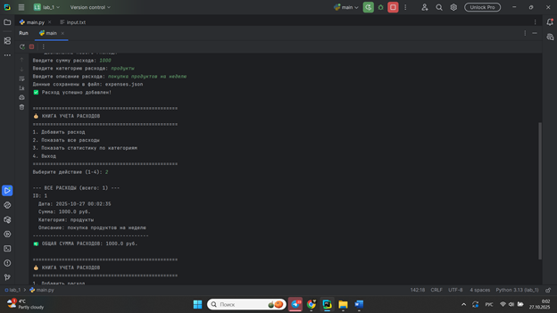

### Вывод: Учет расходов - создана полноценная система ведения финансового учета с сохранением в JSON и статистикой по категориям


## 3) Имеются файл input.txt с текстом на латинице. Напишите программу, которая выводит следующую статистику по тексту: количество букв латинского алфавита; число слов; число строк.

- Текст в файле:
Beautiful is better than ugly.
Explicit is better than implicit.
Simple is better than complex.
Complex is better than complicated.
- Ожидаемый результат:
Input file contains:
108 letters
20 words
4 lines

```python
def analyze_text_file(filename):
    try:
        with open(filename, 'r', encoding='utf-8') as file:
            content = file.read()

        lines = content.splitlines()
        line_count = len(lines)

        words = content.split()
        word_count = len(words)

        letter_count = 0
        for char in content:
            if char.isalpha() and char.isascii():
                letter_count += 1

        print("Input file contains:")
        print(f"{letter_count} letters")
        print(f"{word_count} words")
        print(f"{line_count} lines")

    except FileNotFoundError:
        print(f"Ошибка: Файл {filename} не найден")
    except Exception as e:
        print(f"Ошибка при обработке файла: {e}")


def main():
    filename = "input.txt"
    analyze_text_file(filename)


if __name__ == "__main__":
    main()

```
### Результат
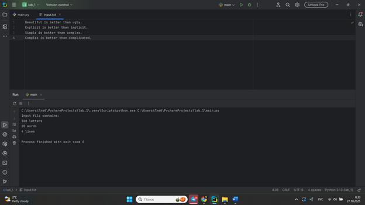
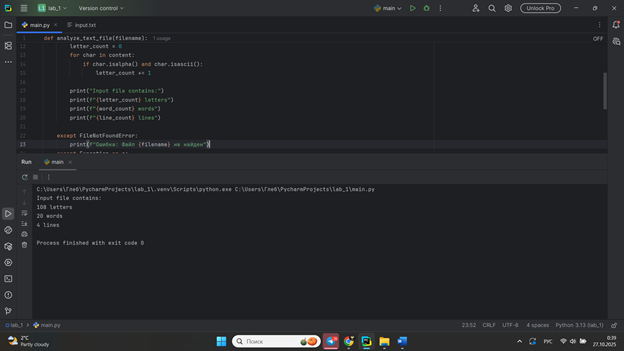

### Вывод: Анализ латинского текста - разработан анализатор для подсчета букв, слов и строк с проверкой символов латинского алфавита


## 4) Напишите программу, которая получает на вход предложение, выводит его в терминал, заменяя все запрещенные слова звёздочками (* количество звёздочек равно количеству букв в слове). Запрещенные слова, разделенные символом пробела, хранятся в текстовом файле input.txt. Все слова в этом файле записаны в нижнем регистре. Программа должна заменить запрещенные слова, где бы они ни встретились, даже в середине другого слова. Замена производится независимо от регистра: если файл input.txt содержит следующее слово exam, то слова экзамен, Exam, ExaM, EXAM и exAm должны быть замены на ****.
- Запрещенные слова:
hello email python the exam wor is
- Предложение для проверки:
Hello, world! Python IS the programming language of thE future. My EMAIL is... PYTHON is awesome!!!
- Ожидаемый результат:
 hello    the   is
*****, ***ld! ****** ** *** programming language of *** future. My ***** **... ****** ** awesome!!!


```python
def load_banned_words(filename):

    try:
        with open(filename, 'r', encoding='utf-8') as file:
            content = file.read().strip()
            banned_words = content.split()
        return banned_words
    except FileNotFoundError:
        print(f"Ошибка: Файл {filename} не найден")
        return []
    except Exception as e:
        print(f"Ошибка при чтении файла: {e}")
        return []


def censor_text(text, banned_words):

    if not banned_words:
        return text

    result = text

    for banned_word in banned_words:

        import re
        pattern = re.compile(re.escape(banned_word), re.IGNORECASE)

        stars = '*' * len(banned_word)
        result = pattern.sub(stars, result)

    return result


def main():
    banned_words = load_banned_words('input.txt')

    if not banned_words:
        print("Нет запрещенных слов для обработки")
        return

    print(f"Запрещенные слова: {banned_words}")
    print("-" * 50)

    text = input("Введите предложение для проверки: ")

    print("\nОригинальный текст:")
    print(text)

    censored_text = censor_text(text, banned_words)

    print("\nРезультат после цензуры:")
    print(censored_text)


if __name__ == "__main__":
    main()
```
### Результат
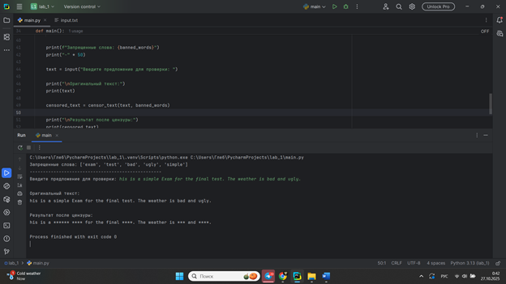

### Вывод: Цензура текста - реализована система фильтрации запрещенных слов с учетом регистра и частичных совпадений


## 5) Самостоятельно придумайте и решите задачу, которая будет взаимодействовать с текстовым файлом.
#### Задача: "Учет посещаемости студентов" Условие:Создать программу для учета посещаемости студентов. Программа должна: Создавать файл с данными о студентах,добавлять записи о посещаемости, показывать статистику посещаемости ,находить студентов с плохой посещаемостью


```python
import datetime


class AttendanceTracker:
    def __init__(self, filename="attendance.txt"):
        self.filename = filename

    def add_student(self, name, student_id):
        """Добавление нового студента"""
        with open(self.filename, 'a', encoding='utf-8') as file:
            file.write(f"СТУДЕНТ|{student_id}|{name}|0|0\n")
        print(f"Студент {name} добавлен")

    def mark_attendance(self, student_id, attended=True):
        """Отметка посещения"""
        lines = []
        found = False

        with open(self.filename, 'r', encoding='utf-8') as file:
            for line in file:
                if line.startswith("СТУДЕНТ"):
                    parts = line.strip().split('|')
                    if parts[1] == student_id:
                        total_classes = int(parts[3]) + 1
                        attended_classes = int(parts[4]) + (1 if attended else 0)
                        line = f"СТУДЕНТ|{parts[1]}|{parts[2]}|{total_classes}|{attended_classes}\n"
                        found = True
                lines.append(line)

        if found:
            with open(self.filename, 'w', encoding='utf-8') as file:
                file.writelines(lines)
            status = "присутствовал" if attended else "отсутствовал"
            print(f"Студент {student_id} {status} на занятии {datetime.date.today()}")
        else:
            print("Студент не найден")

    def add_lecture(self):
        """Добавление записи о проведенной лекции"""
        with open(self.filename, 'a', encoding='utf-8') as file:
            file.write(f"ЛЕКЦИЯ|{datetime.datetime.now()}\n")
        print("Запись о лекции добавлена")

    def show_statistics(self):
        """Показать статистику посещаемости"""
        print("\n" + "=" * 50)
        print("СТАТИСТИКА ПОСЕЩАЕМОСТИ")
        print("=" * 50)

        with open(self.filename, 'r', encoding='utf-8') as file:
            for line in file:
                if line.startswith("СТУДЕНТ"):
                    parts = line.strip().split('|')
                    student_id, name, total, attended = parts[1], parts[2], parts[3], parts[4]
                    if int(total) > 0:
                        percentage = (int(attended) / int(total)) * 100
                        print(f"{name} ({student_id}): {attended}/{total} ({percentage:.1f}%)")
                    else:
                        print(f"{name} ({student_id}): нет данных о посещениях")

    def find_low_attendance(self, threshold=70):
        """Найти студентов с посещаемостью ниже порога"""
        print(f"\nСтуденты с посещаемостью ниже {threshold}%:")
        print("-" * 40)

        with open(self.filename, 'r', encoding='utf-8') as file:
            for line in file:
                if line.startswith("СТУДЕНТ"):
                    parts = line.strip().split('|')
                    student_id, name, total, attended = parts[1], parts[2], parts[3], parts[4]
                    if int(total) > 0:
                        percentage = (int(attended) / int(total)) * 100
                        if percentage < threshold:
                            print(f"{name}: {percentage:.1f}%")

    def show_all_data(self):
        """Показать все данные из файла"""
        print("\nВСЕ ДАННЫЕ ИЗ ФАЙЛА:")
        print("-" * 30)
        try:
            with open(self.filename, 'r', encoding='utf-8') as file:
                print(file.read())
        except FileNotFoundError:
            print("Файл не найден. Создайте сначала студентов.")


def main():
    tracker = AttendanceTracker()

    print("Создаем базу студентов...")
    students = [
        ("Иванов Алексей", "001"),
        ("Петрова Мария", "002"),
        ("Сидоров Дмитрий", "003"),
        ("Козлова Анна", "004")
    ]

    for name, student_id in students:
        tracker.add_student(name, student_id)

    print("\nОтмечаем посещения...")
    attendance_data = [
        ("001", True), ("002", True), ("003", True), ("004", True),  # Лекция 1
        ("001", True), ("002", False), ("003", True), ("004", True),  # Лекция 2
        ("001", False), ("002", True), ("003", True), ("004", False),  # Лекция 3
        ("001", True), ("002", True), ("003", False), ("004", True),  # Лекция 4
    ]

    for student_id, attended in attendance_data:
        tracker.mark_attendance(student_id, attended)
        tracker.add_lecture()

    tracker.show_statistics()
    tracker.find_low_attendance(75)

    print("\nПример содержимого файла:")
    print("-" * 30)
    tracker.show_all_data()


if __name__ == "__main__":
    main()
```
### Результат
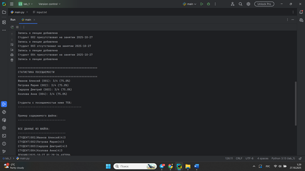

### Вывод: Учет посещаемости - создана комплексная система для отслеживания посещений студентов с расчетом статистики и выявлением проблем


## Общий вывод по теме: 

**Основы работы с файлами в Python**

Работа с файлами является важной частью программирования, и Python предоставляет удобные инструменты для выполнения файловых операций. Для начала работы с файлом используется функция open(), которая принимает путь к файлу и режим доступа. Основные режимы доступа включают: "r" для чтения, "w" для записи, "a" для добавления данных, "b" для бинарного режима и "t" для текстового режима. Также существует комбинированный режим "+", который позволяет одновременно читать и записывать данные.

После открытия файла доступны различные методы для работы с его содержимым. Для чтения данных используются методы read(), который считывает всё содержимое файла, readline(), читающий одну строку, и readlines(), возвращающий список всех строк. Для записи информации применяется метод write(), который записывает переданные данные в файл. При работе с большими файлами или при необходимости точного позиционирования полезны методы seek() и tell(), позволяющие управлять позицией указателя в файле. Метод flush() обеспечивает принудительную запись данных из буфера.

Наиболее рекомендуемым подходом к работе с файлами является использование конструкции with open(), которая автоматически закрывает файл после завершения работы с ним, даже если в процессе выполнения возникли ошибки. Это помогает избежать утечек ресурсов и обеспечивает корректное завершение операций. Дополнительной мерой безопасности является обработка исключений с помощью блоков try-except-finally, что особенно важно при работе с файловой системой, где могут возникать различные ошибки, такие как отсутствие файла или проблемы с правами доступа.

Правильное применение этих принципов и методов обеспечивает надежную работу программы и корректную обработку данных при выполнении файловых операций. Понимание особенностей работы с файлами позволяет создавать более стабильные и эффективные приложения, способные корректно обрабатывать различные сценарии взаимодействия с файловой системой.
